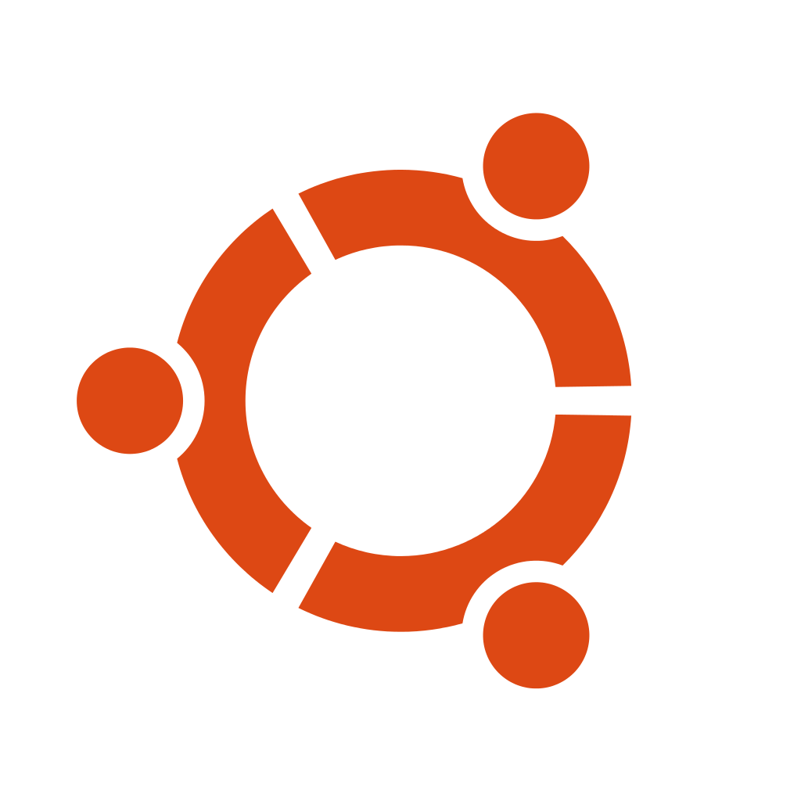

# RTD Power Tools:             
[MinecraftServer](https://github.com/vonschutter/RTD-Setup/blob/main/modules/Minecraft-Server-Manager.mod/README.md) | [NordVPN_GUI](https://github.com/vonschutter/RTD-Setup/blob/main/modules/Nordvpn-Manager.mod/README.md) | [DesktopLookSwitcher](modules/RTD-Desktop-Look-Switcher.mod/README.md) | [Instant VPN Router](/modules/RTD-VPN-Router.mod/README.md) | [Simple Support Tool](/modules/Simple-Support-Tool.mod/README.md)


These Power Tools are created to simplify the life of an enthusiast, a system administrator or developer. If you are the person who lives and breathes in the terminal and know every single system command in the back of your head like a reflex, and you don't mind typing several hundred characters each time you want to, for example, build a VM to test your stuff; this may not be as valuable to you. The purpose of these tools are to expose common tasks and automate them so all you need to do is a few up/down arrows and selections.  Some tools included are (usable over an ssh connection):

- Software Productivity Bundle installer (for tasks like 3D printing, office, secure internet communications etc.)
- Global system update tool to update native packages, flatpaks, and snaps.
- VM builder for Debian, Ubuntu, SUSE, Fedora, and Windows 10
- Debian system cleanup tool
- Add system to an on-premise Ubuntu Landscape Server
- Installation media creator for Debian and Ubuntu Desktops
- Installation media creator for Ubuntu, Debian and Minecraft servers
- Viewing system information
- Removing unused PPA repositories
- Term GUI for NordVPN
- Instant VPN router setup
- and more...

The RTD Setup includes the **Software Bundle Installer** intended to facilitate adding optional software and optimizing configuration of a vanilla install of Ubuntu, Debian (or derivatives), SUSE, Fedora, CentOS based distribution as well as Windows. The bootstrap script (**rtd-me.sh.cmd**) will identify Linux/Mac/BSD/Windows versions and execute those configurations scripts if they are defined. The non Linux or Windows references are essentially empty in the bootstrap script at present, due to lack of testing equipment. However, most of the software intended for Windows and Mac are proprietary and may not be distributed so only freely available software is added. Please keep in mind that this does not mean that the Open Source Software (OSS), or any of the free software in the Windows or linux repositories is less capable. You may well be able to do just about anything with OSS that you can do with proprietary software. The OSS does have one advantage though: it is peer reviewed and will unlikely come with built in back doors (intended or otherwise).  


If a graphical environment is not detected, the RTD System Configurator will interpret this as it is being run on a server without a graphical environment and will offer to set up the productivity tools for that environment.


As promised, the rtd-me.sh.cmd script will run under windows as well. Simply download it and double click on it (you will be prompted to elevate privileges if needed). Please NOTE: that at this time the Windows functionality is roughly equivalent to the Linux **Software Bundle Installer**, but will not prompt for anything, whereas for Linux the setup will pause for 60 seconds to allow for some selections. However, the script will optimize Windows by removing bloatware (Sponsored Software) and turning off services that most do not use to enhance both performance and security. Several useful and fun software titles are automatically added (will not fill up your disk). The Windows changes are made with PowerShell.


# RTD-Me.sh.cmd
To get these tools for yourself on Linux just copy and paste the line below in to a terminal:

```bash
wget https://github.com/vonschutter/RTD-Setup/raw/main/rtd-me.sh.cmd && bash ./rtd-me.sh.cmd
```
Please note that you will need elevated priviledges on the Linux system (root).

If you are using Windows you may copy and paste the same in to your WSL window to use this in WSL. Since it does not make sense to use linux tools in Windows, the power tools themselves are not made available in the Windows environment; but, since the power tools do include an option for automatically building a Windows Desktop Virtual Machine (VDI); this part will be run for you by downloading and executing **rtd-me.sh.cmd**. Please note that you will need elevated privileges. 

On Windows rtd-me.sh.cmd will automatically:
- Add a proper package manager for you (chocolatey)
- Install some useful OSS software (Libre Office, Secure internet browsers and communication tools)
- Debloat Windows (disabling services, telemetry, software not used)
- Fix some minor security settings

Download:
```
https://github.com/vonschutter/RTD-Setup/raw/main/rtd-me.sh.cmd
```
Running RTD Power Tools to add software to WSL in Windows:


# Please Share Back:
It would make me happy if any modifications are shared back, or if any suggestions could be shared. Please read the license file for details. 
