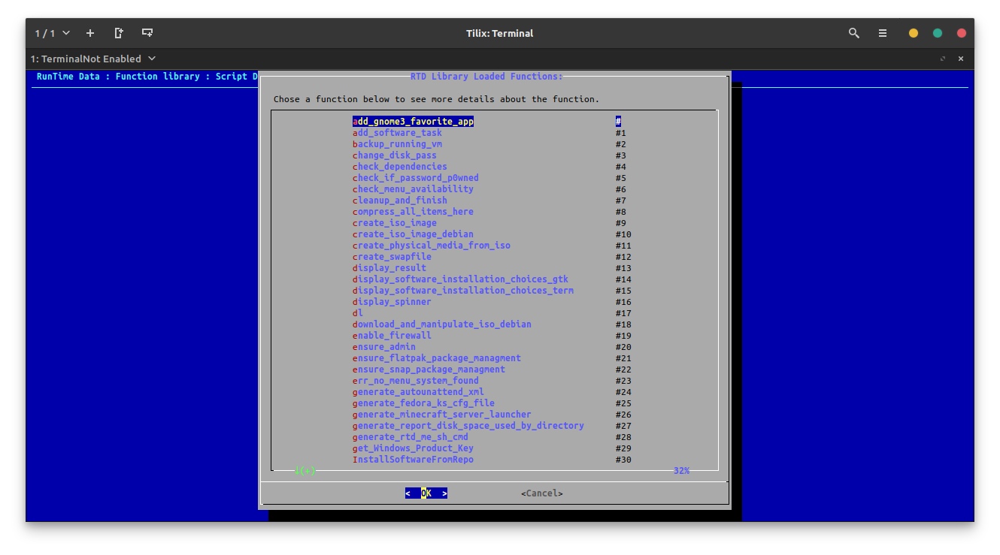
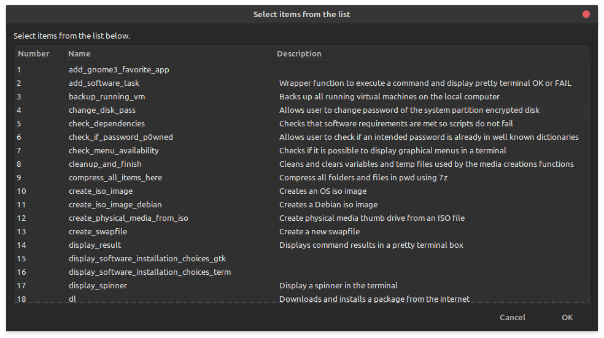

# RTD OEM Tools:


The RTD Toolset is a collection of scripts intended to facilitate adding, optional and highly usefull, software to a vanilla install of Debian, SUSE, or RedHat based distributions automatically. This tool could be useful for a smaller OEM to load systems in a consistent and easy way. Alternatively; an individual may simply want to have an easy way to reload or install another version of Linux without the hasstle of adding all the software or answering all the setup questions. 

 Consider this usecase: You want to move from one distribution to another. To move to a different distribution from the one that you are currently using all you would need to do is run the **rtd-me.sh.cmd** by opening a terminal and typing: 

```
wget https://github.com/vonschutter/RTD-Build/raw/master/rtd-me.sh.cmd ; bash ./rtd-me.sh.cmd 
```
This is simply a convenient way to download and run the script **rtd-me.sh.cmd**. It will download all the tools needed for you to setup an automated thumbdrive or DVD install of fedora, Ubuntu, Kubuntu, Debian and more. Please note that you do not need to install any software bundles at this time. After running the script above, you will have all that you need to create the needed boot media to install teh above distributions. You may accomplish these tasks by running the included tools: 

1. rtd-simple-support-tool
2. rtd-make-usb-boot-media

All the tools rely on the _rtd_library bash function library. To see what these functions are and write scripts that use them you may call the library like so: 
```
---  To see options to use this library type "bash _rtd_library --help"
---  To see usefull documentation on each function in this library in a Terminal or remote ssh: "bash _rtd_library --devhelp"
---  To see usefull documentation on each function in this library in GTK (local desktop): "bash _rtd_library --devhelp-gtk"
```
bash _rtd_library --devhelp (for example if you are using the tool remotely via SSH) would display a help screen: 



bash _rtd_library --devhelp-gtk (useful if you are on a Linux desktop) would display a help screen:




NOTE: software titles may be named slightly differently in some versions of Linux and may 
therefore not install since they are not found. For this reason, more emphasis is placed on 
"snap" apps and "flatpaks" where possible to allow universal installs. Snapps and Flatpaks allow for applications to be sandboxed for security as well.  

The bootstrap (rtd-me.sh.cmd) script will identify the running OS versions and execute the relevant scripts to install software and/or configuration changes. 
