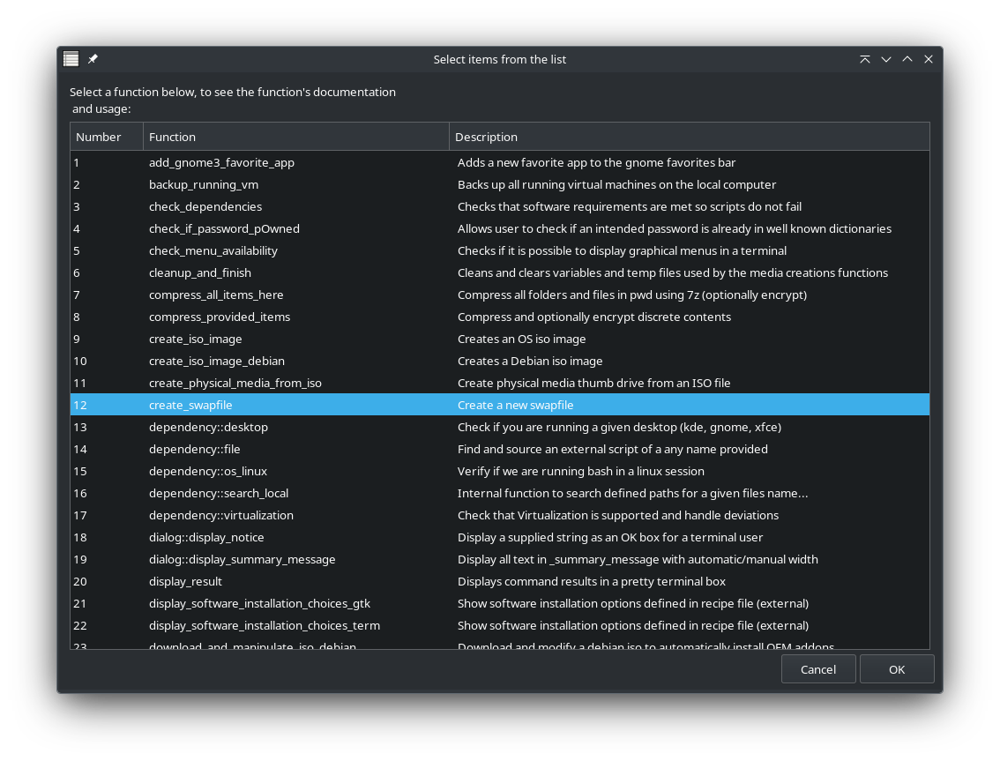

# RTD Power Tools Core

\< [Back](https://github.com/vonschutter/RTD-Setup/blob/main/README.md) |

## Overview:

The core of the RTD Power Tools are the core libraries and the configuration scripts for computers, servers, and VMs. The core library and the configuration files are the following:

* branding: Contains configurations for how things look.
* locations: Contains URLs, file locations, etc.
* _rtd_library: Contains all functions that do the heavy lifting and repeated work.
* _rtd_recipes: Collections of software to make available for install.
* sigs (folder): contains the hashes used to validate the oem apps compressed in the /apps folder
* rtd-oem-enable-config.sh: script to enable the tools when auto installed via PRESEED or AUTOUNATTEND.
* rtd-oem-linux-config.sh: script to configure a server, VDI, VM, or PC using the \_rtd\_library functions.
* rtd-oem-win10-config.ps1: script to configure a server, VDI, VM, or PC.

Further tools and utilities are located in the /apps folder and the /modules folder. These modules may make use of the \_rtd\_library accomplish their tasks. For example; the software-bundle-manager

### What is `_rtd_library`?

`_rtd_library` is the automation “engine room” for the RTD toolset. It wraps hundreds of reusable bash functions for tasks such as:

* Building Kickstart/Preseed/AutoYAST files, provisioning KVM guests, and templating OEM installs.
* Managing desktops (GNOME/KDE tweaks, splash themes, login scripts) and applying OEM branding.
* Installing curated software bundles consistently across Debian, Ubuntu, Fedora, AlmaLinux, SUSE, etc.
* Providing developer-facing helpers (`system::log_item`, `software::check_native_package_dependency`, dialog wrappers) so module scripts stay short and declarative.
* Surfacing inline documentation directly from the shell through `--help`, `--devhelp`, and `--devhelp-gtk`, which makes it easy to rediscover functions while developing or debugging.

In short: source the library once, and every RTD script gains a well-tested catalog of commands and UI helpers. This keeps each module tiny, ensures cross-distro behavior, and gives OEM teams confidence that installs will be identical whether triggered from a live session, a Kickstart/Preseed job, or a remote automation task.

### `_rtd_library` - Function Map

This library is a large collection of Bash functions organized into several logical namespaces.

```bash
.
├── 📜 Standard Interactions & UI
│   ├── dialog::* (TUI dialogs: notice, error, progress, yes/no)
│   ├── yad::*    (GUI dialogs using YAD)
│   ├── zenity::* (GUI dialogs using Zenity)
│   └── term::*   (Terminal animations and formatted output)
│
├── ⚙️ System & OEM Management
│   ├── system::*       (Service management, logging, ISO creation, sys-info)
│   ├── oem::*          (Branding, theming, creating launchers, resealing)
│   ├── gnome::*        (GNOME-specific tweaks: Dash-to-Panel, Nautilus, fonts)
│   └── security::*     (Firewall, encryption, hardening, malware scanning)
│
├── 📦 Software Management
│   ├── software::*     (Install/remove packages, manage Flatpak/Snap, update system)
│   └── dependency::*   (Check for commands, OS, desktop environment)
│
├── 🌐 Network Operations
│   ├── network::*      (Check internet, get public IP, rsync wrappers)
│   └── ssh::*          (Manage SSH keys)
│
├── 🖥️ Virtualization (KVM)
│   ├── kvm::*          (Create, clone, and manage KVM virtual machines)
│   ├── kvm::cicd::*    (Automate VM config with cloud-init and Ansible)
│   ├── kvm::util::*    (VM naming and configuration helpers)
│   └── whonix::*       (Specific functions to deploy Whonix Gateway/Workstation VMs)
│
├── 📝 Templates & Configuration
│   ├── template::*     (Generate config files: AutoYast, Kickstart, preseed, etc.)
│   └── library::*      (Core library functions, path normalization)
│
└── 🛠️ Miscellaneous Tools
    ├── tool::*         (Compress/recompress files, test ISO boot media)
    ├── disk::*         (Device re-encryption)
    └── fedora::*, ubuntu::*, mint::* (Distro-specific ISO downloaders)
```

#### Key Namespaces & Purpose:

* **`dialog::`, `yad::`, `zenity::`**: Provide functions to create interactive prompts and display information to the user in both terminal (TUI) and graphical (GUI) environments.
* **`system::`**: Core functions for interacting with the underlying OS, managing services, handling files, and performing system-level tasks.
* **`software::`**: A complete suite for managing software packages from native repositories, Flatpak, and Snap, including dependency checks and system updates.
* **`oem::` & `gnome::`**: A powerful set of tools for customizing or "branding" a Linux installation with specific themes, wallpapers, default settings, and application launchers.
* **`kvm::`**: Provides extensive automation for creating and managing KVM virtual machines, including downloading ISOs, creating disks, and defining VMs from templates.
* **`security::`**: Functions to enhance system security by configuring firewalls, intrusion detection systems, and encryption.
* **`network::`**: Helpers for network-related tasks like checking connectivity and transferring files securely.

NOTE: For the software bundle installer, and particularly for validating dependencies, software titles may be named slightly differently in some versions of Linux and may therefore not install since they are not found. For this reason, more emphasis is placed on "snap" apps and "flatpaks" where possible to allow universal installs. Snaps and Flatpaks allow for applications to be sandboxed for security as well.

The RTD Power Tools may be installed manually and/or added by either of PRESEED, KICKSTART, AUTOYAST, or AUTOUNATTEND installation configuration files. These configuration files are included by default in the RTD Power Tools Library and are created when needed. These are applied when either creating a VM or installation media using the RTD Power Tools.

| RTD Power Tools Active during a Windows 10 VM Build |
| --- |
|  |

## RTD Power Tools Library Usage:

The RTD Toolset is a collection of scripts intended to facilitate adding, optional and highly useful, software to a vanilla install of Debian, SUSE, or RedHat based distributions automatically. This tool could be useful for a smaller OEM to load systems in a consistent and easy way. Alternatively; an individual may simply want to have an easy way to reload or install another version of Linux without the hassle of adding all the software or answering all the setup questions.

Consider this usecase: You want to move from one distribution to another. To move to a different distribution from the one that you are currently using all you would need to do is run the **rtd-me.sh.cmd** by opening a terminal and typing:

```url
wget https://github.com/vonschutter/RTD-Build/raw/master/rtd-me.sh.cmd ; bash ./rtd-me.sh.cmd 
```

This is simply a convenient way to download and run the script **rtd-me.sh.cmd**. It will download all the tools needed for you to setup an automated thumbdrive or DVD install of fedora, Ubuntu, Kubuntu, Debian and more. rtd-simple-support-tool

many of the tools rely on the \_rtd\_library bash function library. To see what these functions are and write scripts that use them you may call the library like so:

To see options to use this library type:  
`bash bash _rtd_library --help`

```bash
 📚 _rtd_library :: RunTime Data Library HELP  ::

        Usage:
        source _rtd_library (load the library into the current shell)

        Alternate usage:
        _rtd_library [OPTIONS]

        Valid options are:
        --help                : Show this help text
        --list [software|internal|all]
            Where:
            --list software         : List available software bundles
            --list internal         : List internal utility functions
            --list internal package : Filter internal functions by package name (use with --list internal|all)
            --list internal make-doc: Print inline documentation for every function
            --list all              : List software bundles together with internal functions

        --devhelp               : Display developer help in the terminal
        --devhelp-gtk           : Display developer help in a GTK window
        --clean                    : Remove library variables from the current environment
        --version               : Show detailed version information
        --V                     : Show only the version number
        --envcheck              : Report how and where the library was loaded
        --selfcheck             : Run shellcheck to look for syntax issues

        EXAMPLES:
        _rtd_library --list internal
        _rtd_library --list internal kvm::
        _rtd_library --list all
        _rtd_library --devhelp
        _rtd_library --devhelp-gtk
```

### DevHelp main dialog screen:

For example if you are using the tool remotely via SSH, you may display a help screen as illustrated below. This would facilitate working with scripts remotely.

To see useful documentation on each function in this library in a Terminal or remote ssh:  
`bash bash _rtd_library --devhelp`


### DevHelp function description screen:

Once a function is selected the instructions are shown for how to use the function.


### DevHelpGtk main main dialog screen:

Handily if you are on a Linux desktop you may display library function documentation on your desktop using the --devhelp-gtk option.

To see useful documentation on each function in this library in GTK (local desktop):  
`bash bash _rtd_library --devhelp-gtk`



### DevHelp function description screen:

As with the remote option, once selected the gtk dialogs will display documentation on how to use each function.


## Please consider sharing back and contributing:

These scripts are released for the convenience of all and are provided as is. However, all contributions are appreciated. The simplest way to contribute is to provide a shell script to be included in the /modules directory and the shell script itself named with the TLA "rtd'' so that the installer can find it and create a link in the $PATH.

If relevant the existing functions can be used that are present in the \_\_rtd\_\_library, alternatively, useful functions can be included in the RTD Library as well. To do this properly, functions should be added in the header documentation with a short description behind a ";" and the function itself should be documented as the other functions are in the library,such that the description will show up in the DevHelp options.
