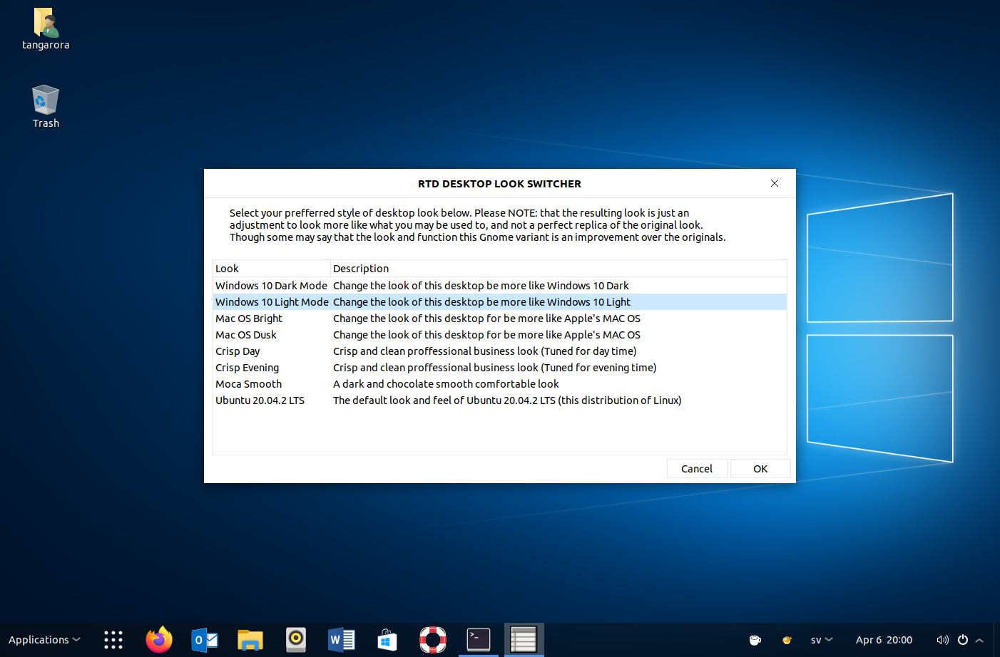
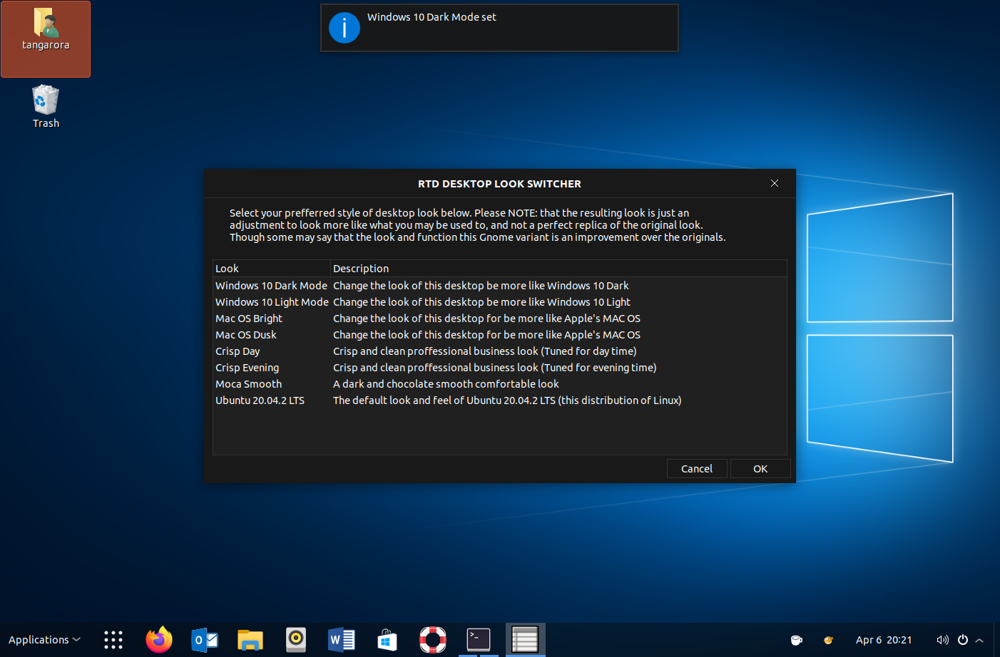
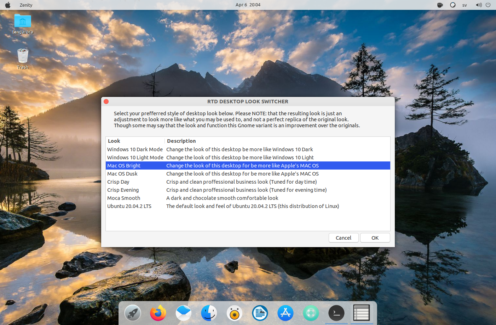
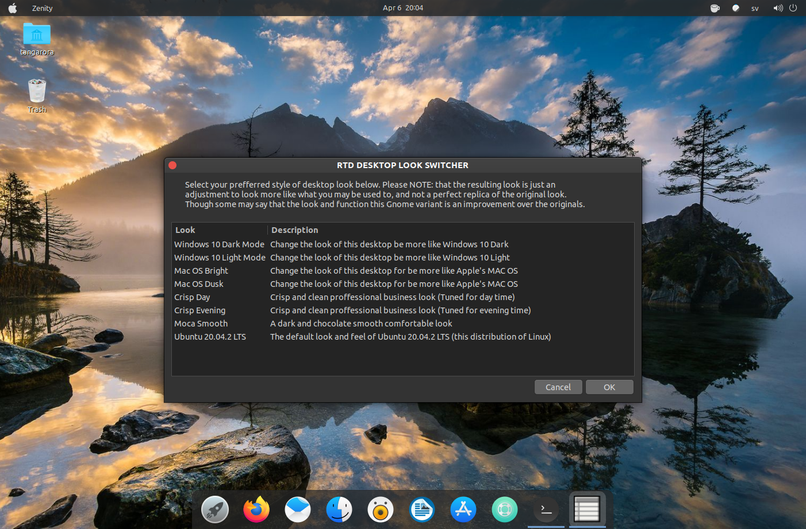
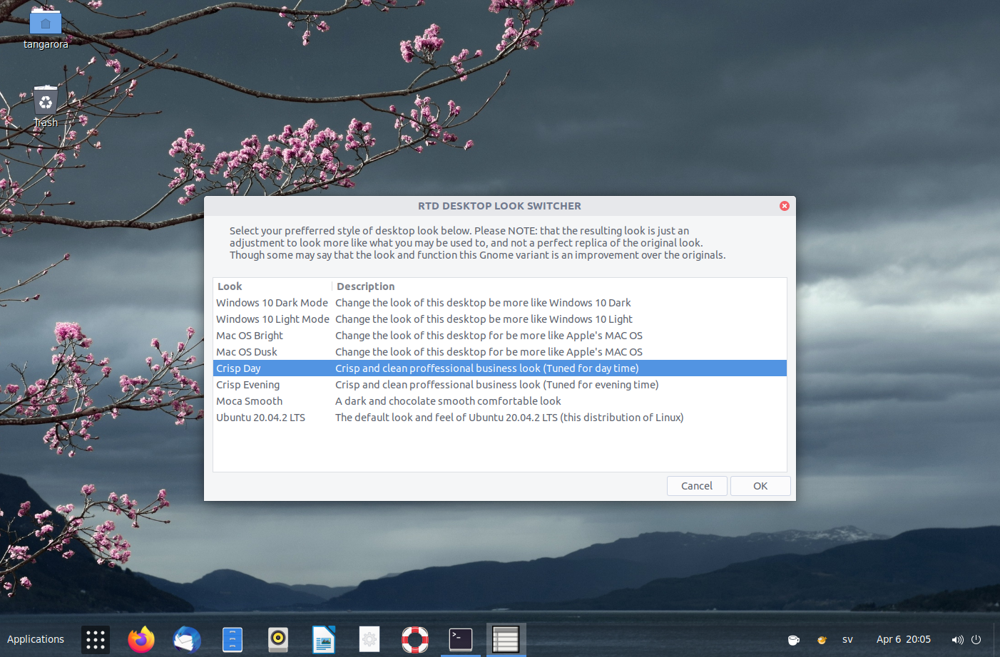
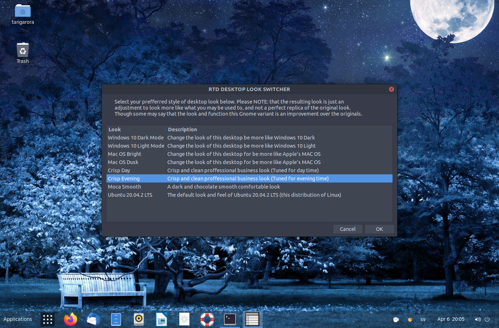
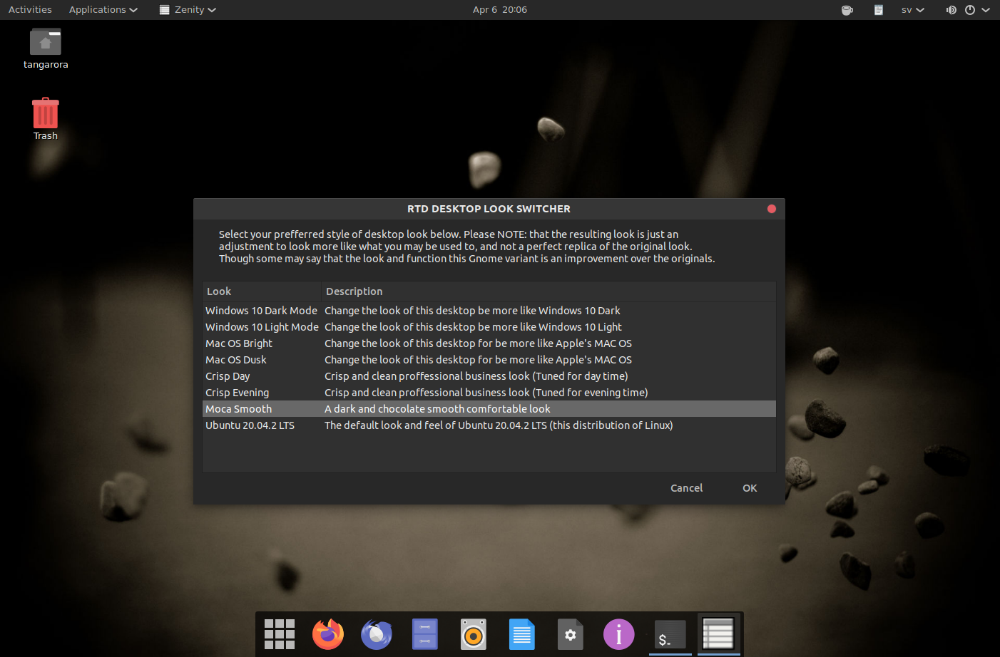
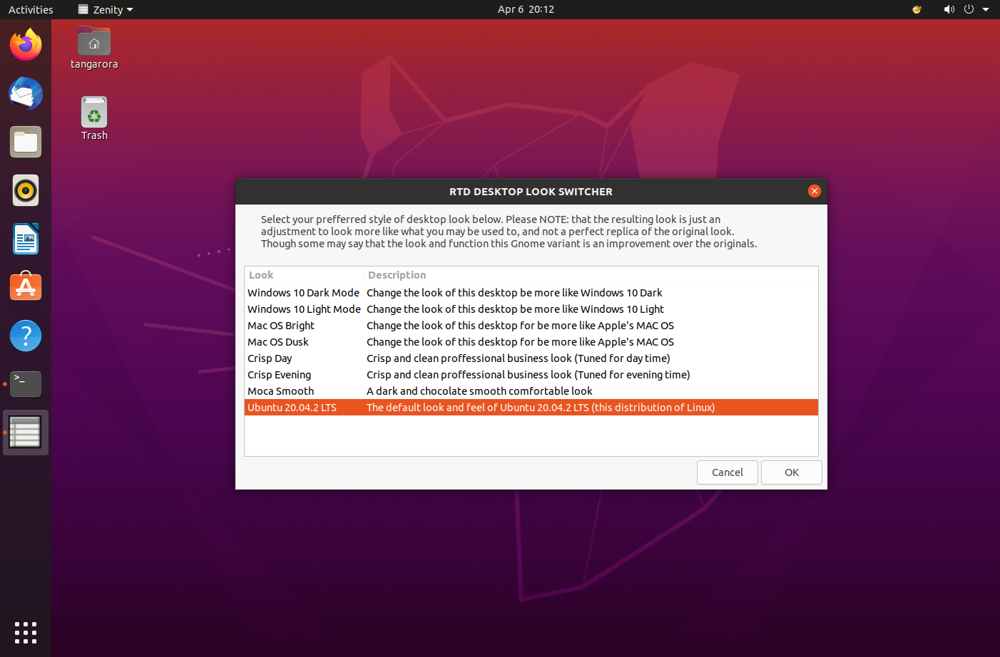

# RTD Desktop Look Switcher
< [Back](https://github.com/vonschutter/RTD-Setup/blob/main/modules/RTD-Desktop-Look-Switcher.mod/README.md) | [ScreenShots](Media_files/SCREENSHOTS.md)

## Screenshots

