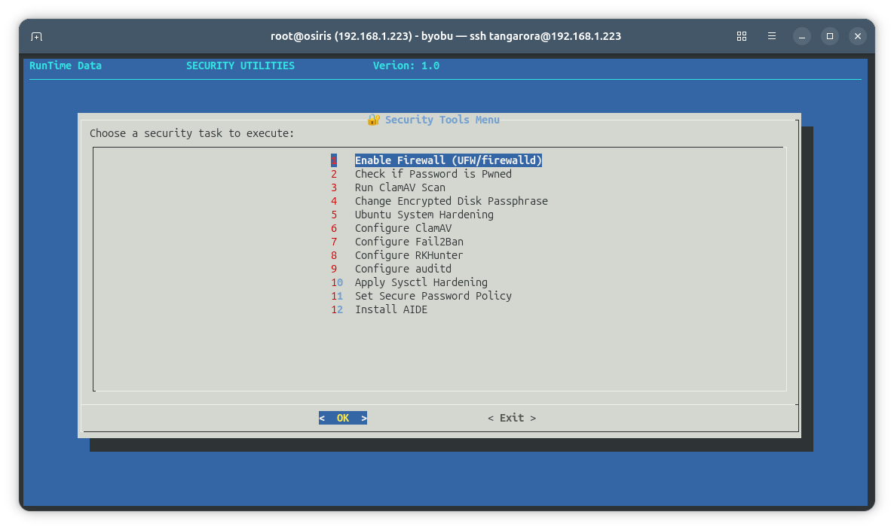

# RTD Security Tool


`rtd-security-tool` is a dialog-based Bash utility that surfaces security hardening and audit actions exposed by the RTD `_rtd_library`. It presents a simple menu to run common security tasks on a KVM/libvirt host or any supported Linux system.

## Features

- Dialog menu to launch key RTD security functions:
  - Enable Firewall (UFW/firewalld) via `security::enable_firewall`
  - Check if password is pwned via `security::check_if_password_pOwned`
  - Run ClamAV scan via `security::scan_for_malware`
  - Change encrypted disk passphrase via `security::change_disk_pass`
  - Ubuntu system hardening via `security::harden_ubuntu`
  - Configure ClamAV via `security::configure_clamav`
  - Configure Fail2Ban via `security::configure_fail2ban`
  - Configure RKHunter via `security::configure_rkhunter`
  - Configure auditd via `security::configure_auditd`
  - Apply sysctl hardening via `security::sysctl_hardening`
  - Set secure password policy via `security::secure_password_policy`
  - Install AIDE via `security::install_AIDE`
- Uses RTD `write_*` helpers and RTD branding/version strings.
- Auto-fetches `_rtd_library` with `dependency::file _rtd_library`; exits if not found.

## Requirements

- Bash shell.
- `dialog` installed (`rtd-security-tool` exits if missing).
- `_rtd_library` available (auto-located or downloaded via `dependency::file _rtd_library`).
- Appropriate privileges for security operations (firewall, auditd, etc.).

## Usage

Run from the module folder or your `$PATH`:

```bash
bash rtd-security-tool
```

If installed on `$PATH`, simply:

```bash
rtd-security-tool
```

## Flow

1. Ensure `dialog` is available.
2. Load `_rtd_library` via `dependency::file _rtd_library` (auto-fetch from GitHub if missing locally).
3. Present the Security Tools menu; user selects a task.
4. Execute the selected `security::` function.

## Screenshot



## Notes

- Most actions require root privileges; expect elevation prompts depending on system policy.
- `_rtd_library` is plain Bash and publicly auditable in the RTD-Setup repository.
- Logging/output follows RTD helper conventions when available.
