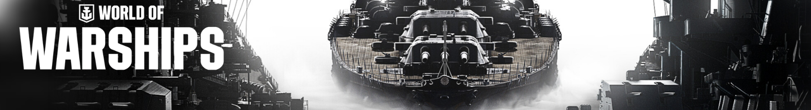

# Steam World of Warships Replay Launcher
< [Back](https://github.com/vonschutter/RTD-Setup/blob/main/README.md) |

The minecraft server launcher script. Setting up your own Minecraft server on Ubuntu has never been easier! Just launch the script and it will do the rest!

## Purpose:
Purpose: The purpose of this script is to simplify watching your replays.
As per the writing of this script World of Warships automatically stores the last 30
replays on your system. There have been many posts asking how to watch them so this
script helps facilitate watching your WoW's replays.

Usage:	Simply execute this script to accomplish this task. No parameters required.
Source: https://developer.valvesoftware.com/wiki/Command_Line_Options#Command-Line_Parameters_2

## How to use this script.
To use this script just download this script (rtd-steam-world-of-warships-replay-launcher)
to your home folder and run it. It will automatically:

1. Install any dependency.
2. Open a file dialog to the right spot.
3. Launch World of Warships replay through Steam with the right parameters.

