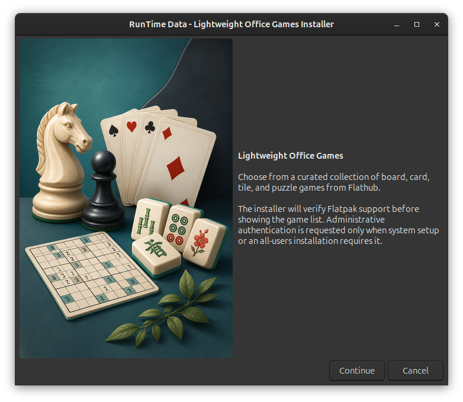
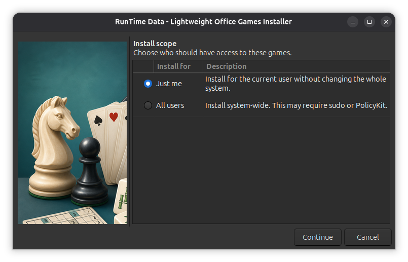
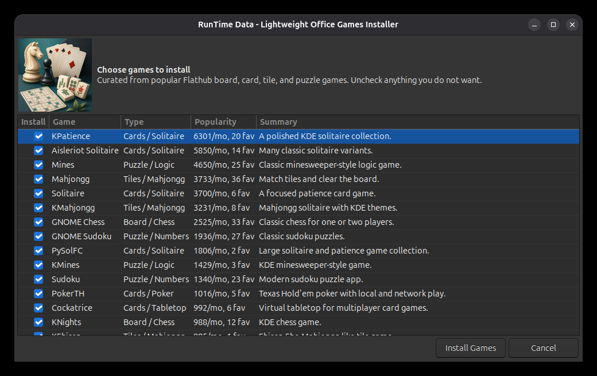

# Lightweight Office Games Installer

[Back to Modules](../README.md) | [Tool Reference](../../docs/TOOLS.md)

`rtd-light-weight-office-games` is a graphical installer for a curated set of lightweight games that fit quiet desktop or office use: solitaire, chess, sudoku, mines, mahjongg, poker, Go, and related tile/card games.

## Usage

```bash
rtd-light-weight-office-games
```

The tool uses YAD when available and falls back to Zenity. If neither dialog tool is installed, it asks for permission before using the shared RTD dependency installer. It tries YAD first and then Zenity if YAD is unavailable from the configured native repositories. Use `--yad` or `--zenity` to force a specific interface for testing:

```bash
rtd-light-weight-office-games --yad
rtd-light-weight-office-games --zenity
```

Its YAD workflow includes branded game artwork, a welcome screen, a scope selector, a streamlined checklist, progress details, and an installation summary. If Flatpak capability is missing, the installer asks for permission before adding Flatpak, the system Flathub remote, Flatseal, and desktop export registration. Approved setup runs with administrative access and displays progress. The installer then asks whether to install games for the current user or system-wide.

## Interface

The default YAD interface opens with a short overview:



Choose whether to install games for the current user or for all users:



Select the games to install:




## Included Games

The default list was curated on 2026-05-30 from Flathub's public Game collection, using `installs_last_month` and `favorites_count` as the available popularity signals. Flathub's public collection API does not expose user star ratings.

| Game                | Flatpak ID                             | Type              |
| ------------------- | -------------------------------------- | ----------------- |
| KPatience           | `org.kde.kpat`                       | Cards / Solitaire |
| Aisleriot Solitaire | `org.gnome.Aisleriot`                | Cards / Solitaire |
| Mines               | `org.gnome.Mines`                    | Puzzle / Logic    |
| Mahjongg            | `org.gnome.Mahjongg`                 | Tiles / Mahjongg  |
| Solitaire           | `org.gnome.gitlab.wwarner.Solitaire` | Cards / Solitaire |
| KMahjongg           | `org.kde.kmahjongg`                  | Tiles / Mahjongg  |
| GNOME Chess         | `org.gnome.Chess`                    | Board / Chess     |
| GNOME Sudoku        | `org.gnome.Sudoku`                   | Puzzle / Numbers  |
| PySolFC             | `io.sourceforge.pysolfc.PySolFC`     | Cards / Solitaire |
| KMines              | `org.kde.kmines`                     | Puzzle / Logic    |
| Sudoku              | `io.github.sepehr_rs.Sudoku`         | Puzzle / Numbers  |
| PokerTH             | `net.pokerth.PokerTH`                | Cards / Poker     |
| Cockatrice          | `io.github.Cockatrice.cockatrice`    | Cards / Tabletop  |
| KNights             | `org.kde.knights`                    | Board / Chess     |
| KShisen             | `org.kde.kshisen`                    | Tiles / Mahjongg  |
| Kigo                | `org.kde.kigo`                       | Board / Go        |

## Requirements

- A graphical desktop session
- `yad` or `zenity`
- Network access to Flathub
- Permission to authenticate once if Flatpak capability setup is required

The shared RTD Flatpak helper configures missing capability through the host package manager. The installer uses Flatpak packages from Flathub and does not use snaps.

## Scope

- Current user: installs with `flatpak --user`
- All users: installs with `flatpak --system`, using `sudo` where needed

System-wide installation may prompt for administrative credentials.
