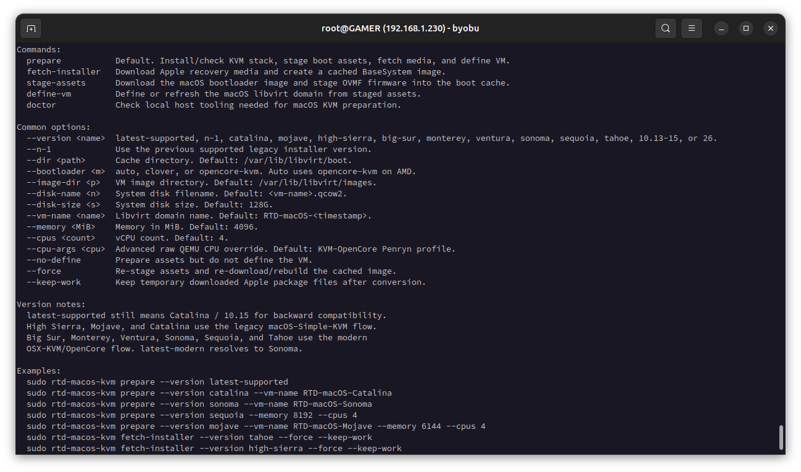
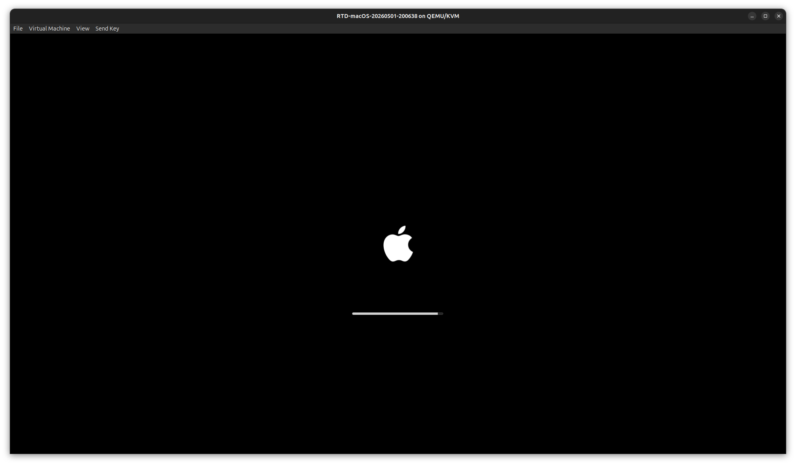
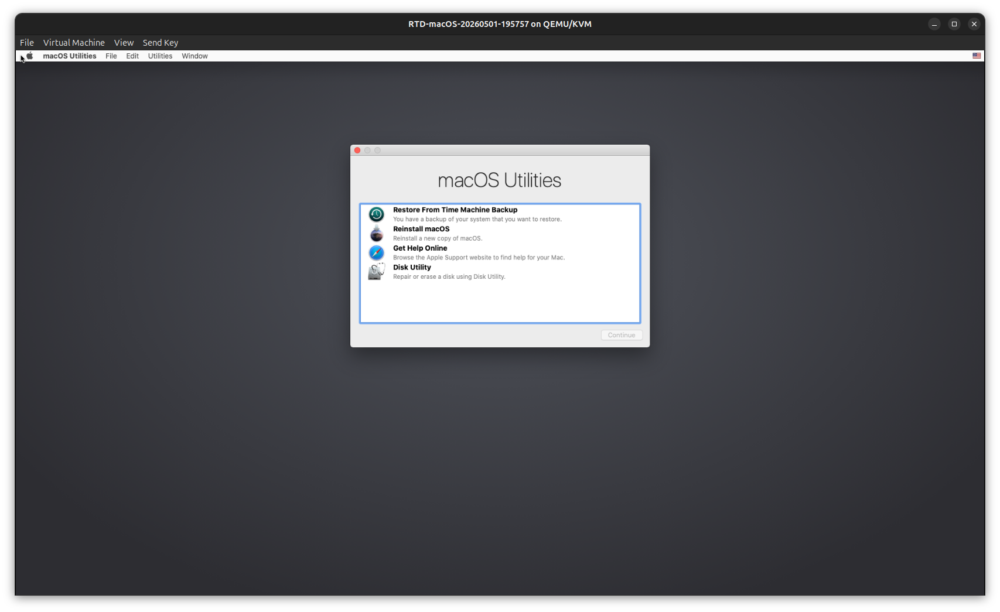
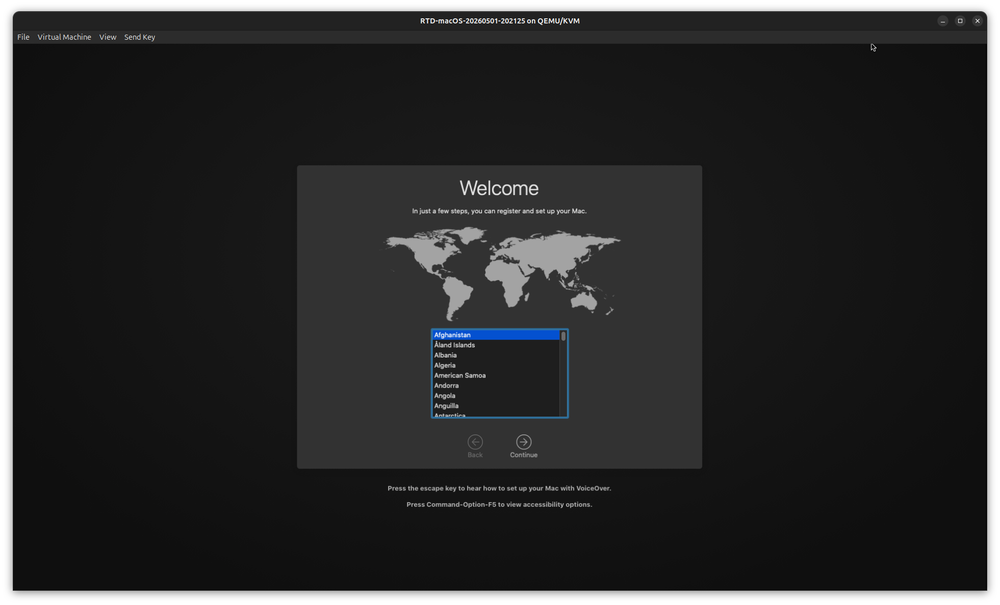
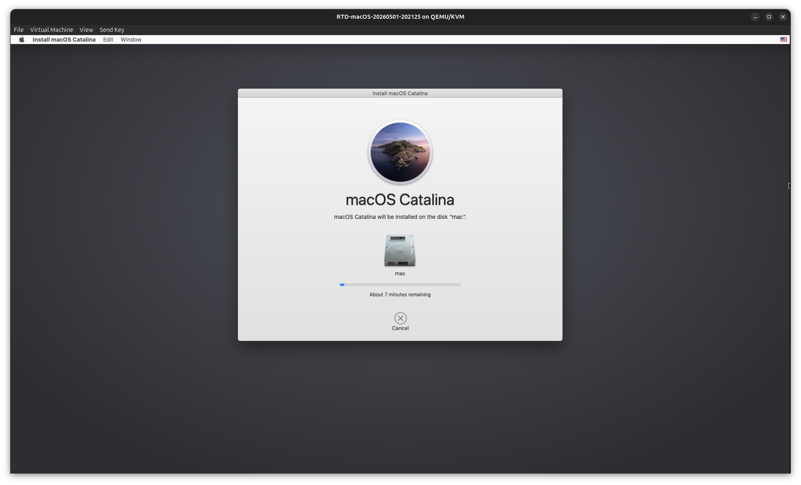
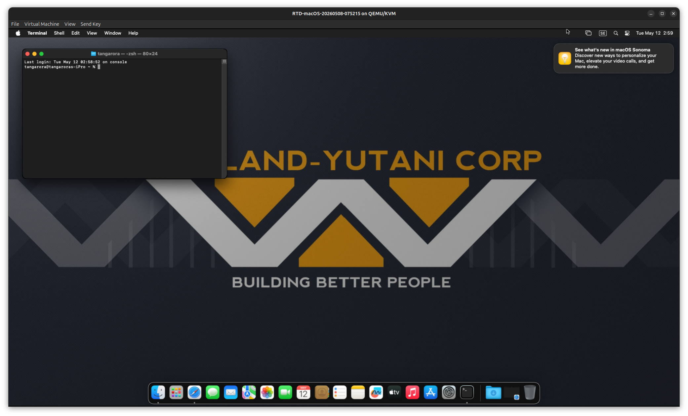

# RTD macOS KVM Module

This module prepares a Linux host for macOS QEMU/KVM workflows without storing large Apple installer images in the RTD-Setup repository.

## Purpose

`rtd-macos-kvm` uses the same practical model RTD uses for Linux ISO files, but includes the extra KVM and firmware preparation macOS needs:

- installs/checks QEMU, KVM, libvirt, OVMF, `dmg2img`, and Python fetch tooling
- stages a bootloader image in the libvirt boot cache; legacy `auto` keeps the previous AMD/OpenCore and Intel/Clover behavior, while modern macOS releases always use OpenCore
- copies OVMF CODE and VARS firmware images into the libvirt boot cache
- creates a writable qcow2 system disk if one does not already exist
- downloads installer source data on demand
- converts `BaseSystem.dmg` into a QEMU-readable `BaseSystem-<version>.img`
- defines the VM in libvirt so it appears in virt-manager
- caches the generated image under `/var/lib/libvirt/boot`
- exports the resulting path through the shared RTD `iso` variable pattern

The module does not vendor `BaseSystem.img`, macOS installers, or large generated media.

## Usage

```bash
sudo rtd-macos-kvm
sudo rtd-macos-kvm prepare
sudo rtd-macos-kvm prepare --n-1
```

With no command or version, the module preserves the existing behavior: it prepares the host, fetches Catalina / `10.15`, and defines a new libvirt domain named `RTD-macOS-<timestamp>`.
Legacy guests default to 4096 MiB RAM. Big Sur and newer default to 8192 MiB RAM unless `--memory` is provided.

The bootloader can be selected explicitly:

```bash
sudo rtd-macos-kvm prepare --bootloader opencore-kvm
sudo rtd-macos-kvm prepare --bootloader clover
```

Supported version values are:

- `latest-supported`, `latest`, or `default` for Catalina / `10.15`
- `n-1`, `previous`, or `previous-supported` for Mojave / `10.14`
- `catalina` or `10.15`
- `mojave` or `10.14`
- `high-sierra` or `10.13`
- `latest-modern`, `modern`, or `modern-default` for Sonoma / `14`
- `big-sur` or `11`
- `monterey` or `12`
- `ventura` or `13`
- `sonoma` or `14`
- `sequoia` or `15`
- `tahoe` or `26`

High Sierra, Mojave, and Catalina use the legacy macOS-Simple-KVM recovery flow. Big Sur and newer route through the modern OSX-KVM/OpenCore recovery flow.

Installer-only usage is still available:

```bash
sudo rtd-macos-kvm fetch-installer --version catalina
sudo rtd-macos-kvm fetch-installer --n-1
sudo rtd-macos-kvm fetch-installer --version sonoma
```

To rebuild a cached image:

```bash
sudo rtd-macos-kvm prepare --force
```

To customize the libvirt VM definition:

```bash
sudo rtd-macos-kvm prepare --vm-name RTD-macOS --memory 8192 --cpus 4 --disk-size 128G
sudo rtd-macos-kvm prepare --version sonoma --vm-name RTD-macOS-Sonoma --memory 8192 --cpus 4
```

The default CPU profile follows the KVM-OpenCore Penryn-style QEMU mask, including `vendor=GenuineIntel`, `+hypervisor`, `+invtsc`, `kvm=on`, `vmware-cpuid-freq=on`, and the XSAVE flags required for AVX/AVX2 state. If a host needs a different raw QEMU CPU mask, override it with `--cpu-args` or set `MACOSKVM_CPU_ARGS`.

Ventura and newer require host AVX2 exposure. The modern workflow checks for AVX2 before fetching media and warns when the host clocksource suggests possible TSC instability, because newer macOS releases are less tolerant of unstable timekeeping.

OpenCore is staged with verbose recovery boot arguments by default: `-v keepsyms=1 debug=0x100 npci=0x2000`. Override that with `MACOSKVM_BOOT_ARGS` before running `prepare`.

OpenCore is staged with a 5-second boot picker timeout by default. Override that with `MACOSKVM_OPENCORE_TIMEOUT`; set it to `0` to wait indefinitely.

Each run creates a timestamped writable OpenCore image from the cached base image so older or running VMs do not block boot-argument updates.

The VM uses ICH9 EHCI/UHCI USB controllers plus USB and PS/2 input fallbacks for Catalina recovery compatibility.

The NIC is modeled as `e1000-82545em` on PCI bus `0x00`, slot `0x05` so macOS sees it as built-in Ethernet while using libvirt's default NAT network.

OpenCore and BaseSystem media are marked `snapshot='no'`; only the writable macOS system disk should participate in VM snapshots.

Existing VMs keep the XML they were created with. Re-run `rtd-macos-kvm prepare` to create a new timestamped VM after changing module defaults, then boot the new VM instead of an older `RTD-macOS-*` entry.

To define the VM from already staged assets:

```bash
sudo rtd-macos-kvm define-vm
```

To prepare media without defining the VM:

```bash
sudo rtd-macos-kvm prepare --no-define
```

To inspect host readiness:

```bash
rtd-macos-kvm doctor
```

## Screenshots

### Tool Output



### VM Boot



### Recovery Utilities



### First Setup



### Installer Progress



### Desktop



## Output Location

Generated installer images are stored here by default:

```text
/var/lib/libvirt/boot/BaseSystem-catalina.img
/var/lib/libvirt/boot/BaseSystem-mojave.img
/var/lib/libvirt/boot/BaseSystem-high-sierra.img
/var/lib/libvirt/boot/BaseSystem-sonoma.img
/var/lib/libvirt/boot/BaseSystem-sequoia.img
/var/lib/libvirt/boot/BaseSystem-tahoe.img
/var/lib/libvirt/boot/OpenCore-KVM-v21.img
/var/lib/libvirt/boot/ESP-macos-clover.qcow2
/var/lib/libvirt/boot/OVMF_CODE-macos.fd
/var/lib/libvirt/boot/OVMF_VARS-macos.fd
/var/lib/libvirt/boot/RTD-macOS-<timestamp>.xml
/var/lib/libvirt/images/RTD-macOS-<timestamp>.qcow2
/var/lib/libvirt/qemu/nvram/RTD-macOS-<timestamp>_VARS.fd
```

The cache directory can be overridden with `--dir`.
The VM image directory, disk filename, and disk size can be overridden with `--image-dir`, `--disk-name`, and `--disk-size`.

## Dependencies

The module uses RTD's native package dependency helper to ensure these tools are available:

- `python3`
- `python3-venv` and `python3-pip` when available
- `curl` or `wget`
- `dmg2img`
- QEMU/KVM tooling
- libvirt tooling
- OVMF/edk2 UEFI firmware
- KVM-OpenCore boot image for modern macOS, and legacy KVM-OpenCore/Clover behavior for older macOS

## Upstream Helper

The legacy Apple catalog fetch logic comes from `foxlet/macOS-Simple-KVM`. The modern recovery fetch logic comes from `kholia/OSX-KVM`'s `fetch-macOS-v2.py`. Bootloader media comes from `thenickdude/KVM-Opencore` for OpenCore workflows and `foxlet/macOS-Simple-KVM` for the legacy Clover workflow. RTD downloads those assets at runtime instead of copying them into this module.

The default helper URL can be overridden:

```bash
MACOSKVM_FETCHMACOS_URL=https://example.local/fetch-macos.py \
sudo rtd-macos-kvm fetch-installer --version catalina

MACOSKVM_MODERN_FETCHMACOS_URL=https://example.local/fetch-macOS-v2.py \
sudo rtd-macos-kvm fetch-installer --version sonoma
```

## Legal Note

This module only automates media preparation. It does not grant rights to run macOS on unsupported hardware or redistribute Apple software. Use it only where your Apple license terms and local requirements allow it.
