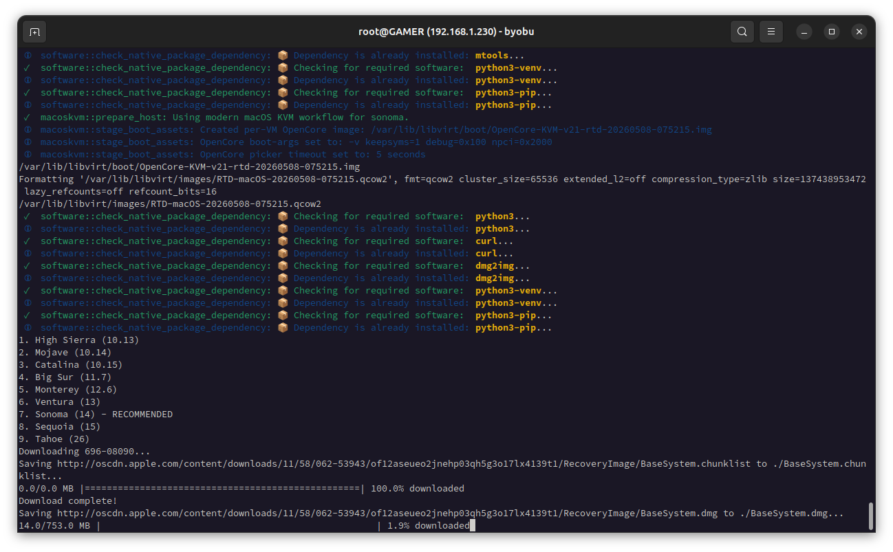
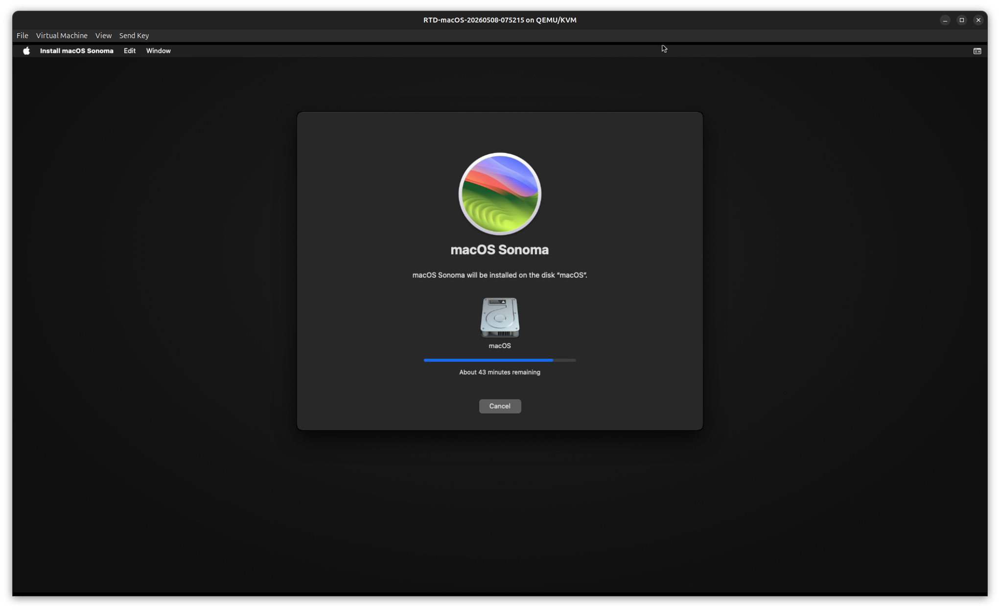
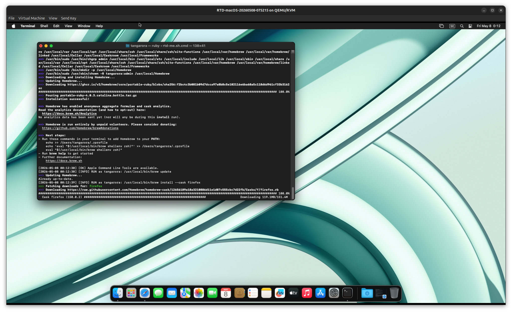

# RTD macOS KVM Module


`rtd-macos-kvm` prepares a Linux host for running macOS recovery installers in QEMU/KVM through libvirt. It installs or checks the host tools, downloads the needed upstream helper assets at runtime, builds a cached macOS `BaseSystem` image, creates a writable system disk, stages firmware and boot media, and defines a libvirt VM that can be opened in virt-manager.

The module is meant for light testing, configuration work, and development tasks where a macOS guest is useful. It is not tuned for graphics-heavy workloads.

## What It Does

The default command is `prepare`. A normal run:

1. Checks or installs QEMU/KVM, libvirt, OVMF, `dmg2img`, Python, `curl` or `wget`, and related helper tools.
2. Starts/enables libvirt where possible and ensures the default libvirt NAT network is available.
3. Chooses the correct macOS recovery workflow for the requested version.
4. Downloads the upstream Apple recovery helper script when needed.
5. Fetches Apple recovery package data and converts `BaseSystem.dmg` to a QEMU-readable image.
6. Stages OpenCore or Clover boot media in `/var/lib/libvirt/boot`.
7. Copies OVMF CODE and VARS firmware into the libvirt boot cache.
8. Creates a writable qcow2 system disk under `/var/lib/libvirt/images` if it does not already exist.
9. Defines a timestamped libvirt domain named `RTD-macOS-<timestamp>` unless `--vm-name` is supplied.

The module does not store Apple installers, generated `BaseSystem` images, OpenCore images, or large VM media in Git. Generated assets are cached on the local host.

## Quick Start

Check host readiness:

```bash
rtd-macos-kvm doctor
```

Create the default VM:

```bash
sudo rtd-macos-kvm
```

This is the same as:

```bash
sudo rtd-macos-kvm prepare --version latest-supported
```

For backward compatibility, `latest-supported` still means Catalina / `10.15`. The run defines a new VM in libvirt. Open it with virt-manager or start it with `virsh`, then use macOS Recovery to format the writable disk and install macOS.

Create a modern macOS VM:

```bash
sudo rtd-macos-kvm prepare --version sonoma --vm-name RTD-macOS-Sonoma --memory 8192 --cpus 4
```

Rebuild cached media and boot assets:

```bash
sudo rtd-macos-kvm prepare --version sonoma --force
```

Prepare all assets without defining a VM:

```bash
sudo rtd-macos-kvm prepare --version sonoma --no-define
```

## Commands

`prepare`
: Default command. Installs/checks host tooling, stages firmware and boot media, fetches installer media, creates the system disk, and defines the VM.

`fetch-installer`
: Downloads Apple recovery media and creates a cached `BaseSystem-<version>.img`. It does not stage firmware, create a VM disk, or define a VM.

`stage-assets`
: Downloads/stages the bootloader image and OVMF firmware only.

`define-vm`
: Defines or refreshes a libvirt domain from already staged assets.

`doctor`
: Checks for the main host tools and firmware paths used by the module.

Examples:

```bash
sudo rtd-macos-kvm prepare --version catalina --vm-name RTD-macOS-Catalina
sudo rtd-macos-kvm prepare --version sequoia --memory 8192 --cpus 4
sudo rtd-macos-kvm fetch-installer --version tahoe --force --keep-work
sudo rtd-macos-kvm stage-assets --bootloader opencore-kvm --force
sudo rtd-macos-kvm define-vm --vm-name RTD-macOS-Test --disk-name RTD-macOS-Test.qcow2 --memory 8192
```

## macOS Versions

Supported version selectors:

| Selector | Result | Workflow |
| --- | --- | --- |
| `latest-supported`, `latest`, `default`, `catalina`, `10.15` | Catalina | Legacy macOS-Simple-KVM |
| `n-1`, `previous`, `mojave`, `10.14` | Mojave | Legacy macOS-Simple-KVM |
| `high-sierra`, `10.13` | High Sierra | Legacy macOS-Simple-KVM |
| `latest-modern`, `modern`, `sonoma`, `14` | Sonoma | Modern OSX-KVM/OpenCore |
| `big-sur`, `11` | Big Sur | Modern OSX-KVM/OpenCore |
| `monterey`, `12` | Monterey | Modern OSX-KVM/OpenCore |
| `ventura`, `13` | Ventura | Modern OSX-KVM/OpenCore |
| `sequoia`, `15` | Sequoia | Modern OSX-KVM/OpenCore |
| `tahoe`, `26` | Tahoe | Modern OSX-KVM/OpenCore |

High Sierra, Mojave, and Catalina use the legacy `macOS-Simple-KVM` recovery flow. Big Sur and newer use the modern `OSX-KVM` recovery helper and OpenCore.

## Important Defaults

- Cache directory: `/var/lib/libvirt/boot`
- VM image directory: `/var/lib/libvirt/images`
- VM name: `RTD-macOS-<timestamp>`
- Writable disk: `<vm-name>.qcow2`
- Disk size: `128G`
- vCPUs: `4`
- Memory: `4096` MiB for legacy guests, `8192` MiB for modern guests
- Legacy bootloader: `auto`, which uses OpenCore on AMD hosts and Clover otherwise
- Modern bootloader: OpenCore only

Useful options:

```bash
sudo rtd-macos-kvm prepare \
  --version sonoma \
  --vm-name RTD-macOS-Sonoma \
  --memory 8192 \
  --cpus 4 \
  --disk-size 160G
```

Override cache and image locations:

```bash
sudo rtd-macos-kvm prepare \
  --version catalina \
  --dir /var/lib/libvirt/boot \
  --image-dir /var/lib/libvirt/images \
  --disk-name RTD-macOS-Catalina.qcow2
```

Keep temporary Apple package downloads for troubleshooting:

```bash
sudo rtd-macos-kvm fetch-installer --version sonoma --force --keep-work
```

## Options By Mode

`prepare` accepts the full workflow options: `--version`, `--n-1`, `--dir`, `--bootloader`, `--image-dir`, `--disk-name`, `--disk-size`, `--vm-name`, `--memory`, `--cpus`, `--cpu-args`, `--no-define`, `--force`, and `--keep-work`.

`fetch-installer` accepts installer media options: `--version`, `--n-1`, `--dir`, `--work-dir`, `--catalog-id`, `--force`, and `--keep-work`. Big Sur and newer are automatically routed to the modern OSX-KVM helper; legacy versions use the macOS-Simple-KVM helper.

`stage-assets` accepts boot asset options: `--dir`, `--bootloader`, and `--force`.

`define-vm` accepts VM definition options: `--vm-name`, `--memory`, `--cpus`, `--cpu-args`, `--dir`, `--image-dir`, `--disk-name`, `--macos-profile`, and `--force`. It expects the installer image, boot media, firmware files, and system disk to already exist. Use `prepare` when you want the tool to create those assets for you.

## Host Requirements

The host must support KVM hardware virtualization and needs writable access to the libvirt boot and image directories. Run `prepare`, `fetch-installer`, and `stage-assets` with `sudo` when dependencies or cache files need to be installed or written.

The module checks for:

- `python3`
- `python3-venv` and `python3-pip` when available
- `curl` or `wget`
- `dmg2img`
- `gzip`
- `mtools` / `mcopy`
- `qemu-system-x86_64`
- `qemu-img`
- `virsh`
- libvirt and virt-install tooling
- OVMF / edk2 UEFI firmware

Ventura and newer require host AVX2 exposure. The modern workflow checks for AVX2 before fetching media and warns when the host clocksource suggests possible TSC instability, because newer macOS guests are less tolerant of unstable timekeeping.

## Boot And VM Behavior

Modern macOS releases always use OpenCore. The staged OpenCore image is copied to a timestamped per-VM image on every run so boot-argument changes do not modify a base image that older or running VMs may still use.

OpenCore defaults:

- Boot arguments: `-v keepsyms=1 debug=0x100 npci=0x2000`
- Boot picker timeout: `5` seconds

Override them before running `prepare`:

```bash
MACOSKVM_BOOT_ARGS="-v keepsyms=1 debug=0x100" \
MACOSKVM_OPENCORE_TIMEOUT=0 \
sudo rtd-macos-kvm prepare --version sonoma
```

CPU defaults:

- Legacy profile: Penryn-style QEMU CPU mask.
- Modern profile: Skylake-Client-style QEMU CPU mask with AVX/AVX2 state exposed.

Override the raw QEMU CPU mask with `--cpu-args` or `MACOSKVM_CPU_ARGS` only when the default profile does not work on a specific host.

VM device defaults:

- Firmware: OVMF pflash with per-domain NVRAM under `/var/lib/libvirt/qemu/nvram`
- Machine type: `q35`
- Boot, installer, and system disks attached on SATA
- OpenCore/Clover and `BaseSystem` media marked `snapshot='no'`
- Graphics: SPICE with `vmvga`
- Sound: ICH9
- Input: USB tablet and keyboard
- Legacy network model: `e1000-82545em`
- Modern network model: `virtio`
- Libvirt network: `default`

Existing VMs keep the XML they were created with. Re-run `rtd-macos-kvm prepare` to create a new timestamped VM after changing module defaults, then boot the new VM instead of an older `RTD-macOS-*` entry.

## Output Locations

Generated installer and boot files are stored here by default:

```text
/var/lib/libvirt/boot/BaseSystem-catalina.img
/var/lib/libvirt/boot/BaseSystem-mojave.img
/var/lib/libvirt/boot/BaseSystem-high-sierra.img
/var/lib/libvirt/boot/BaseSystem-big-sur.img
/var/lib/libvirt/boot/BaseSystem-monterey.img
/var/lib/libvirt/boot/BaseSystem-ventura.img
/var/lib/libvirt/boot/BaseSystem-sonoma.img
/var/lib/libvirt/boot/BaseSystem-sequoia.img
/var/lib/libvirt/boot/BaseSystem-tahoe.img
/var/lib/libvirt/boot/OpenCore-KVM-v21.img
/var/lib/libvirt/boot/OpenCore-KVM-v21-rtd-<timestamp>.img
/var/lib/libvirt/boot/ESP-macos-clover.qcow2
/var/lib/libvirt/boot/OVMF_CODE-macos.fd
/var/lib/libvirt/boot/OVMF_VARS-macos.fd
/var/lib/libvirt/boot/RTD-macOS-<timestamp>.xml
/var/lib/libvirt/images/RTD-macOS-<timestamp>.qcow2
/var/lib/libvirt/qemu/nvram/RTD-macOS-<timestamp>_VARS.fd
```

Temporary Apple package downloads are placed under:

```text
/var/lib/libvirt/boot/.rtd-macos-work/
/var/lib/libvirt/boot/.rtd-macos-modern-work/
```

They are removed after conversion unless `--keep-work` is used.

## Guest Installation Notes

After the VM boots into macOS Recovery:

1. Open Disk Utility.
2. Erase the writable qcow2 disk, usually the largest blank disk, as APFS.
3. Quit Disk Utility.
4. Run the macOS installer and select the newly erased disk.

The `BaseSystem` image is only recovery/install media. The installed macOS system goes onto the writable qcow2 system disk.

## Guest Configuration

After macOS is installed, `core/rtd-oem-macos-config.sh` can be run inside the guest to apply RTD workstation defaults and install a starter application bundle through Homebrew Cask.

```bash
bash rtd-oem-macos-config.sh
bash rtd-oem-macos-config.sh --preset apps
bash rtd-oem-macos-config.sh --preset minimal
```

The default `workstation` preset installs Firefox, Brave, VLC, Keka, LibreOffice, Visual Studio Code, Rectangle, and The Unarchiver. It also copies `Wayland.jpg` and `Wayland-dark.jpg` from the RTD wallpaper folder into the macOS user's Pictures folder and sets the active desktop picture, so a completed RTD guest is visually identifiable. Use `--no-wallpaper` to skip that step. The `apps` preset installs only the application bundle, while `minimal` skips application installation and applies only the configuration defaults.

Fresh newer macOS installs may need Apple Command Line Tools before every Homebrew operation is fully reliable. The config script requests Command Line Tools when they are missing, continues with the Homebrew/cask install attempt, and logs any cask failures individually. If the Apple installer is still running or finishes after the script has moved on, rerun the script after Command Line Tools are available.

When `rtd-me.sh.cmd` is run on macOS, it stays a bootstrapper: it replaces `/opt/rtd/core/rtd-oem-macos-config.sh` with the current copy from the RTD repository and runs that installed configure script. Wallpaper retrieval and desktop picture setup remain owned by `rtd-oem-macos-config.sh`, which can use local RTD wallpaper files or download them from the repository as a fallback.

## Environment Overrides

Installer helper URLs:

```bash
MACOSKVM_FETCHMACOS_URL=https://example.local/fetch-macos.py \
sudo rtd-macos-kvm fetch-installer --version catalina

MACOSKVM_MODERN_FETCHMACOS_URL=https://example.local/fetch-macOS-v2.py \
sudo rtd-macos-kvm fetch-installer --version sonoma
```

Boot media URLs:

```bash
MACOSKVM_ESP_URL=https://example.local/ESP.qcow2 \
MACOSKVM_OPENCORE_URL=https://example.local/OpenCore-v21.iso.gz \
sudo rtd-macos-kvm stage-assets --force
```

VM tuning:

```bash
MACOSKVM_CPU_ARGS="Skylake-Client,kvm=on,vendor=GenuineIntel,+hypervisor,+invtsc" \
sudo rtd-macos-kvm prepare --version sonoma
```

## Screenshots

| Tool Output | Sonoma Installer | Sonoma Install Progress |
| --- | --- | --- |
|  |  |  |
| VM Boot | Recovery Utilities | First Setup |
|  |  |  |
| Catalina Installer | macOS Desktop | Homebrew App Install |
|  |  |  |

## Upstream Helpers

The legacy Apple catalog fetch logic comes from `foxlet/macOS-Simple-KVM`. The modern recovery fetch logic comes from `kholia/OSX-KVM`'s `fetch-macOS-v2.py`. Bootloader media comes from `thenickdude/KVM-Opencore` for OpenCore workflows and `foxlet/macOS-Simple-KVM` for the legacy Clover workflow. RTD downloads those assets at runtime instead of copying them into this module.

## Legal Note

This module only automates media preparation. It does not grant rights to run macOS on unsupported hardware or redistribute Apple software. Use it only where your Apple license terms and local requirements allow it.
