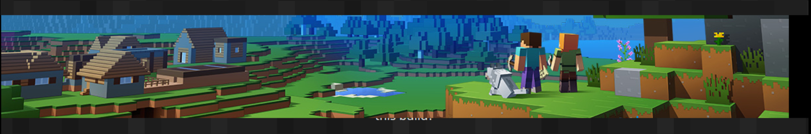

# RTD Minecraft Server Manager
< [Back](https://github.com/vonschutter/RTD-Setup/blob/main/README.md) |


Launch and watch a dedicated Java Minecraft server with one command. The manager builds a small console environment (byobu panes for the server log, `htop`, and `speedometer`), ensures Java and the server jar exist, and keeps the server running.


## Usage
```bash
# installed via RTD Power Tools
rtd-minecraft-server

# or run standalone
wget https://github.com/vonschutter/RTD-Setup/raw/main/modules/minecraft-server-manager.mod/rtd-minecraft-server -O ~/rtd-minecraft-server
chmod +x ~/rtd-minecraft-server && ~/rtd-minecraft-server

# prompt to pull the latest server jar before starting
~/rtd-minecraft-server update
```

## What it does
- Creates/uses `~/bin/minecraft.server/Minecraft.Latest` as the server home
- Writes helper files (`start.sh`, `announce.py`, `server.properties`, `eula.txt`) if they are missing
- Installs prerequisites (`byobu`, `htop`, `speedometer`, `dialog`, Java 22) when needed
- Offers to download the latest Mojang server jar if `update` is passed on the command line
- Starts a byobu session: server console, `htop`, bandwidth monitor, and a separate pane for LAN announcements

Close byobu when you are finished; reconnect later with `byobu attach -t $USER` to return to the console.
