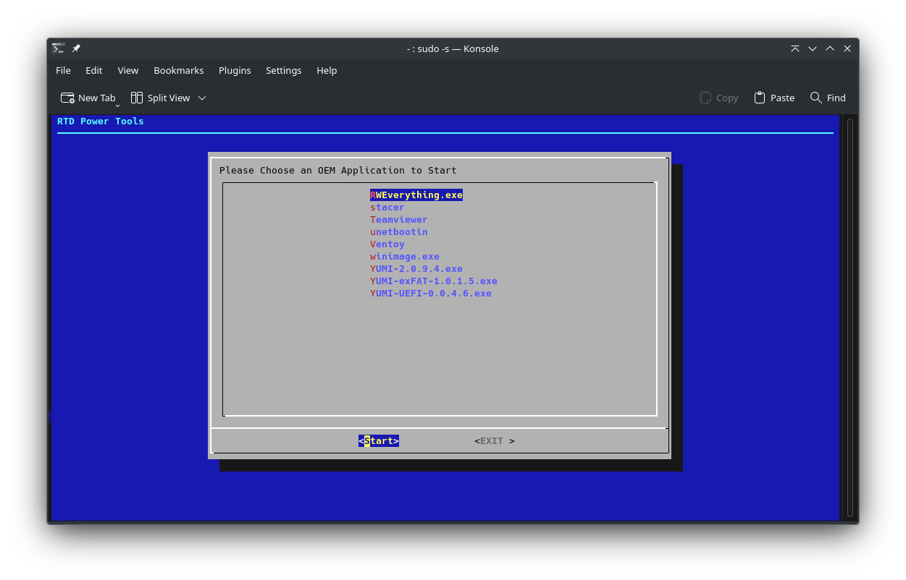
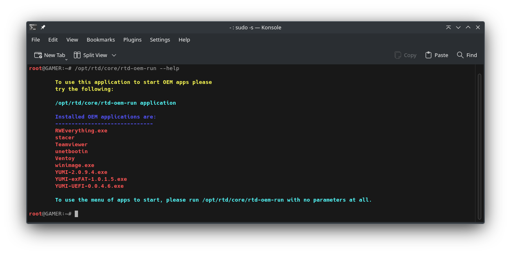

# RTD OEM APP Runner

< [Back](https://github.com/vonschutter/RTD-Setup/blob/main/README.md) |

The OEM App Runner is a tool to run support programs on a computer securely and reliably. This tool is part of the RTD Power Tools.


## Overview

This is a simple tool to run OEM tools. These may be to create boot media and other tasks from a verified tool. The tools are stored in compressed files to use as little space as possible and are checked for consistency prior to being run. The runner will: 

* Validate each packaged `.7z` payload against the signed hash stored in `core/sigs`
* Unpack to a temporary working directory and run the binary (native or via Wine when needed)
* Clean up the temporary files so no configuration is left behind

### Usage
```bash
# show menu of available OEM payloads
rtd-oem-app-runner

# run a specific payload directly
rtd-oem-app-runner <payload-name>

# refresh cached .7z payloads from GitHub and update signatures
rtd-oem-app-runner --refresh

# view inline help
rtd-oem-app-runner --help
```

When the tool starts it scans `modules/oem-app-runner.mod/apps` for `.7z` bundles, verifies the checksum, extracts the bundle to a temporary directory, marks the main binary as executable, and launches it. Windows payloads are offered through Wine if present. All actions are logged to `~/.config/rtd/log` (or `/var/log/rtd` when run as root).

If the tool is run with no options at all: 



If the tool is run with the "--help" option:


