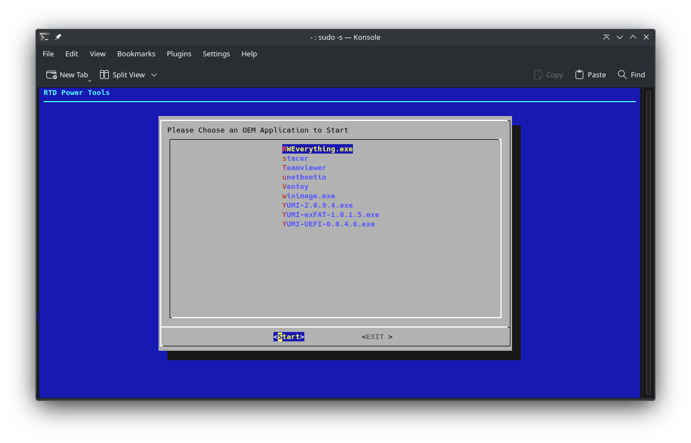

# RTD OEM APP Runner

< [Back](https://github.com/vonschutter/RTD-Setup/blob/main/README.md) |

The OEM App Runner is a tool to run support programs on a computer securely and reliably. This tool is part of the RTD Power Tools.

## Overview

This is a simple tool to run OEM tools. These may be to create boot media and other tasks from a verified tool. The tools are stored in compressed files to use as little space as possible and are checked for consistency prior to being run. The runner will: 

* Validate the executable with a hash
* Run the tool in an evergreen way
* On exit, not store any configuration items

If the tool is run with no options at all: 

If the tool is run with the "--help" option:

