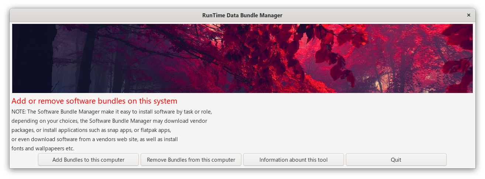
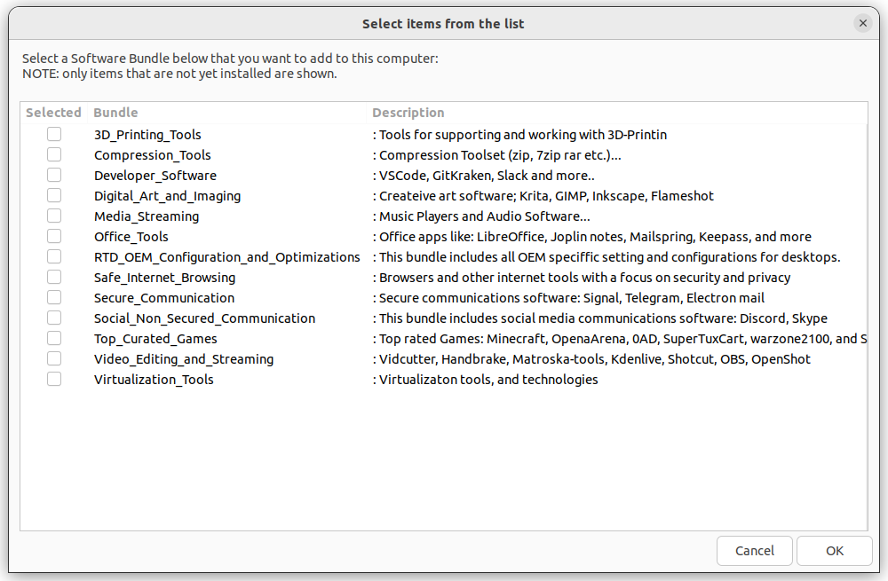
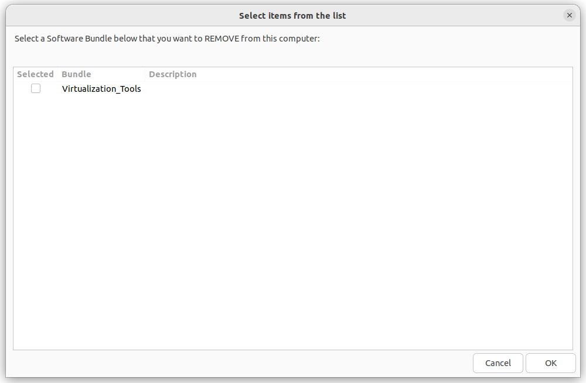

# OEM Bundle Manager
< [Back](https://github.com/vonschutter/RTD-Setup/blob/main/README.md) |

The OEM Bundle Manager is part of the Power Tools, and makes it easy to add and remove groups of packages. A group of packages are usually grouped around a capability or set of tasks, and could be considered roles.

For example, you may have a bundle called "3D_Printing" that will install all applications needed to work with 3D Printing. These applications can be added or removed by simply checking a box. A bundle can also be a collection of themes, or fonts, or a set of configurations; not just a list of software and plugins.

## Overview

The purpose of this tool is to facilitate the easy adding and removal of extra apps/config and other items useful for a complete and productive desktop environment.

- Feature: this tool "detects" how to install and update software and tweak the system.
- Flexible: This tool works on several distributions of Linux since it uses "RTD Functions''. Of course, you could simply list all the "apt", "yum", or "zypper" commands along with the "snap" and "flatpak" to install the software needed. However, you would likely need separate scripts for each distribution AND you could not select or deselect software bundles or specific titles. The OEM Bundle Manager uses a simple GUI to select and make sure app configurations, and other items are added.
- Smart: The "recipes" also downloads setup files from vendors with no repositories, and that do not have "snaps".
- Resilient: This RTD bundle manager is therefore resilient, stable, and flexible since it is built to partially succeed rather than fail.

To use the OEM Bundle Manager open a terminal and type:

```bash
rtd-oem-bundle-manager
```

The main window will let you choose between a few options: to add bundles, remove bundles, or detailed information about the tool itself.



When selecting "Add Bundles to this computer" you will see a list of bundles available to install on your computer. Only bundles that have not already been installed will be listed in this dialog. To the right of the Bundle name there is a brief description of the contents of the bundle. Bundles are defined in the "_rtd_recipes" file.

NOTE: Software is not provided as part of the OEM Bundle Manager of the RTD Power Tools, but downloaded from the internet when needed.



Once a bundle is added to your computer, it may be removed by choosing the "Remove Bundles from this computer" from the selection in the main window. Any installed bundles will be listed here. Selecting it in this window will remove it from your computer.



### Installation Guide

To install this tool it is recommended to install the RTD Power Tools for which it is a part.

```bash
wget https://github.com/vonschutter/RTD-Setup/raw/main/rtd-me.sh.cmd && bash ./rtd-me.sh.cmd
```

It may also be possible to simply download the script and run it as a stand alone script because it will try to satisfy ist own dependencies by downloading them as needed:

```bash
wget https://raw.githubusercontent.com/vonschutter/RTD-Setup/main/modules/RTD-OEM-bundle-manager/rtd-oem-bundle-manager
./rtd-oem-bundle-manager
```

Alternatively, try using the direct download link:

[Direct Download Link](https://raw.githubusercontent.com/vonschutter/RTD-Setup/main/modules/RTD-OEM-bundle-manager/rtd-oem-bundle-manager "Use the save asd button in your browser")

## Questions and comments

If you have any trouble running this tool, please log an issue.
