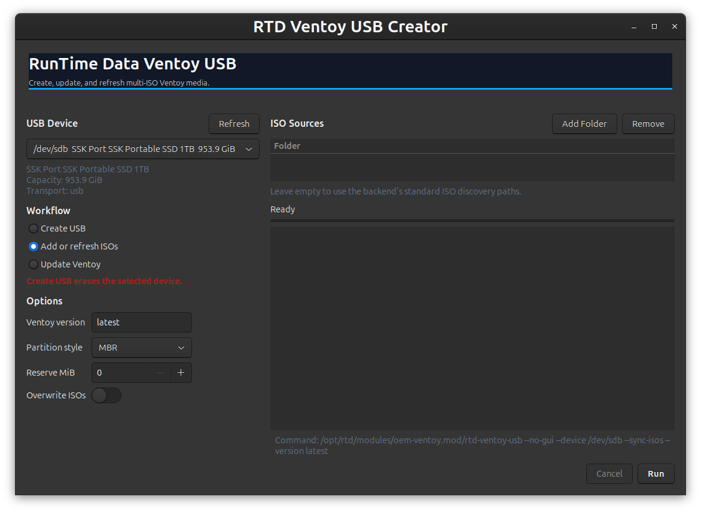

# RTD Ventoy USB Creator 💾🧭



Interactive helper that wraps the Ventoy functions in `core/_rtd_library` to build a branded, multi-ISO USB stick in just a few steps.

## What It Does
- 🚀 Downloads the latest (or requested) Ventoy release to a cache directory.
- 🔌 Prompts for the target removable USB drive (or honor `--device`).
- 🧹 Installs Ventoy (destructive), formats the data partition as ext4.
- 📁 Builds RTD folder layout and copies discovered ISOs grouped by type.
- 💿 Adds or refreshes ISOs on an existing Ventoy USB without recreating it.
- 🎨 Applies a RunTime Data Ventoy boot theme with a branded background.

## Quickstart
```bash
rtd-ventoy-usb
# or specify the device and allow overwrites
rtd-ventoy-usb --device /dev/sdb --overwrite
# add or refresh ISOs without wiping or updating Ventoy
rtd-ventoy-usb --device /dev/sdb --sync-isos --source ~/Downloads
```

## Options
- `--device /dev/sdX` : Explicit target block device.
- `--version 1.0.99`  : Pin a Ventoy version (default: latest).
- `--dest /path`      : Cache/extract Ventoy into a custom directory.
- `--update`          : Update Ventoy in place and refresh `/ventoy` files.
- `--recreate`        : Wipe the USB and recreate the full Ventoy layout.
- `--sync-isos`       : Copy ISOs to an existing Ventoy USB without wiping it.
- `--overwrite`       : Replace ISOs that already exist on the stick.
- `--gui`             : Launch the graphical frontend when available.
- `--no-gui`          : Force the terminal/dialog workflow.
- `-h, --help`        : Show help.
- `-V, --script-version` : Print wrapper version.

## Graphical Routing
- In GNOME or KDE graphical sessions, the launcher routes to the GTK frontend when no CLI arguments are passed.
- Use `--gui` to force the GTK frontend or `--no-gui` to force the terminal/dialog workflow.
- The GTK frontend discovers removable USB devices, runs create/update/sync workflows through the backend, and streams live progress output.
- Existing scripted CLI usage remains unchanged.

## Ventoy Boot Branding
- The tool installs a self-contained theme under `/ventoy/rtd-theme` on the USB data partition.
- `/ventoy/ventoy.json` points Ventoy at `/ventoy/rtd-theme/theme.txt` using Ventoy's supported theme plugin.
- The branded background asset is `Media_files/rtd-ventoy-background-1024x768.png` and is copied as `/ventoy/rtd-theme/background.png`.
- Branding is refreshed automatically during `--recreate`, `--update`, and `--sync-isos`.

## Progress Output
- ISO sync emits stream-friendly progress lines while copying:
  - Human-readable `ISO copy progress: ...` status lines.
  - Machine-readable `RTD_PROGRESS phase=iso-copy ...` lines for the GTK TextView/progress bar.

## Dialog-Driven UX
- Uses `dialog` for notices and confirmation before running the destructive step.
- Falls back to simple terminal prompts if `dialog` is unavailable.

## Safety
- ⚠️ **ALL DATA ON THE SELECTED DEVICE WILL BE ERASED.**
- `--sync-isos` is non-destructive and does not recreate or update Ventoy.
- Requires tools such as `dialog`, `curl`/`wget`, `tar`, `gzip`; these are checked/installed via the shared RTD library loader.

## File Map
- `rtd-ventoy-usb` — entry point; sources `core/_rtd_library` and calls `oem::ventoy::setup_usb`.
- `ventoy-usb-gtk.py` — internal GTK frontend for GNOME/KDE sessions.
- `Media_files/rtd-ventoy-background-1024x768.png` — branded Ventoy boot background copied to the USB.
