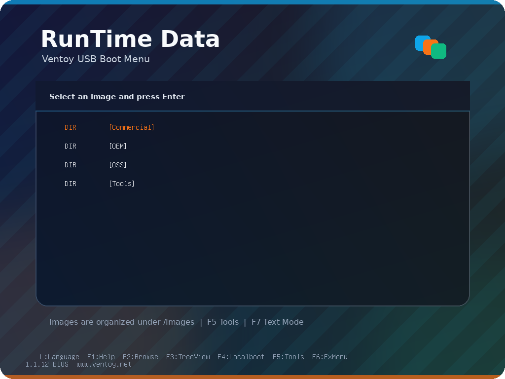
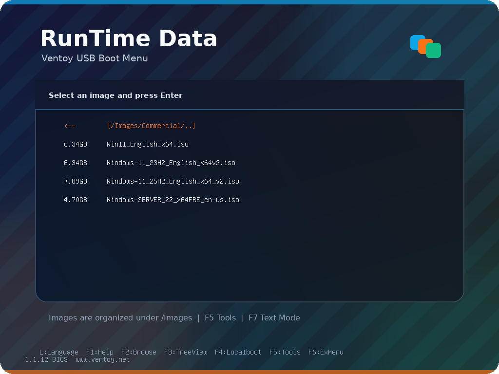
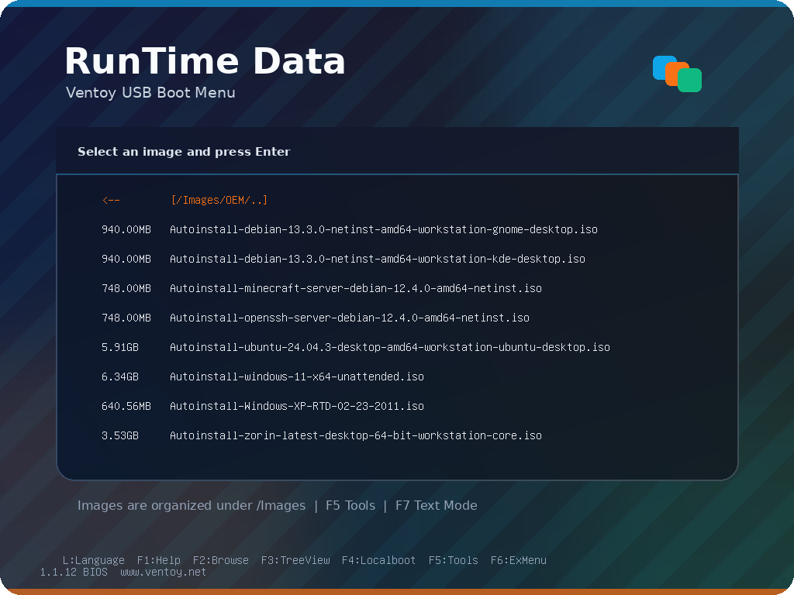
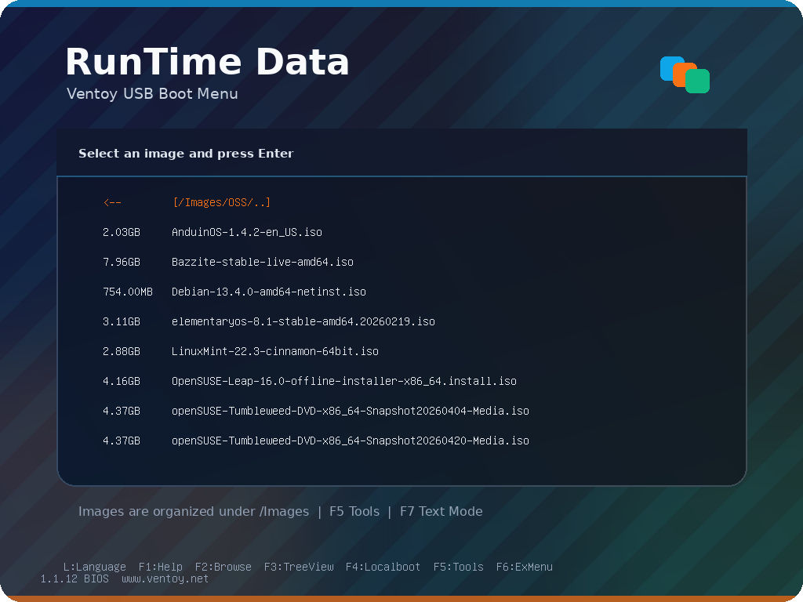
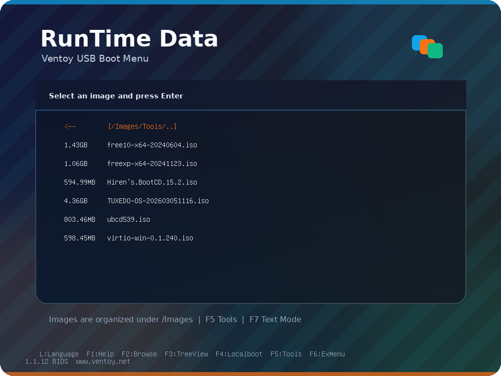

# RunTime Data Ventoy USB Creator

`rtd-ventoy-usb` creates and maintains the RunTime Data Ventoy USB drive for bootable ISO collections, including OEM auto install ISO Virtual DVD's. It supports all bootable files that the standard Ventoy supports including Microsoft Windows, Linux, BSD, and bootable system maintenance images like Hiren's tools.

From the main UI you can create a new RunTime Data Ventoy bootable USB, refresh bootable images for Windows, Linux, BSD etc. as well ase ubtade the Ventoy boot system itself.

The RunTime Data Ventoy USB tool uses the software from the open source Ventoy project. Please see [https://www.ventoy.net/en/index.html](https://www.ventoy.net/en/index.html) for more information about Ventoy.

## The RunTime Data Ventoy image mamangement UI


## Common CLI (Command Line) Tasks

Should a graphical interface not be available RunTime Data's Ventoy tool is simple to use on the command line. Please see below for common uses.

Usage:

```bash
Create a fresh Ventoy USB drive with RTD defaults. The script will download Ventoy,
either update Ventoy in place or recreate the selected USB device, keep the Ventoy
data partition in its native layout, and write the RTD Ventoy configuration.

Options:
  --device <path>    Target USB block device (e.g., /dev/sdb). Prompts if omitted.
  --version <ver>    Ventoy version to install (default: latest release).
  --dest <dir>       Cache directory for Ventoy downloads.
                     Default: /var/lib/rtd/ventoy as root, otherwise ~/.cache/rtd/ventoy.
  --update           Update Ventoy in place and refresh /ventoy files without copying ISOs.
  --recreate         Wipe the USB device and recreate the full Ventoy USB layout.
  --sync-isos        Add or refresh ISO files on an existing Ventoy USB without
                     updating Ventoy or wiping the device.
  --mbr              Install Ventoy using MBR partition style (default, best for old BIOS).
  --gpt              Install Ventoy using GPT partition style.
  --reserve-mib <n>  Preserve MiB at end of disk to improve old BIOS compatibility.
  --source <path>    Extra ISO source directory to scan. Repeatable.
  --overwrite        Overwrite existing ISOs when copying to the Ventoy drive.
  --gui              Launch the graphical frontend when available.
  --no-gui           Force the terminal/dialog workflow.
  -h, --help         Show this help text and exit.
  -V, --script-version
                     Print script wrapper version.

Examples:
  rtd-ventoy-usb
  rtd-ventoy-usb --device /dev/sdb --update
  rtd-ventoy-usb --device /dev/sdb --sync-isos --source ~/Downloads
  rtd-ventoy-usb --device /dev/sdb --source /var/lib/libvirt/boot --overwrite

```

Create a new RunTime Data Ventoy USB drive (answer questions in UI):

```bash
rtd-ventoy-usb
```

Force the graphical RunTime Data Ventoy workflow (if you are using some uncommon graphical environment):

```bash
rtd-ventoy-usb --gui
```

Update RunTime Data OEM Ventoy on the USB:

```bash
rtd-ventoy-usb --device /dev/sdX --update
```

Add or refresh ISO files without recreating the USB:

```bash
rtd-ventoy-usb --device /dev/sdX --sync-isos --source ~/Downloads
```

## Safety

`--recreate` erases the selected USB device. Confirm the selected drive path carefully before continuing.

`--sync-isos` is non-destructive. It mounts the existing Ventoy data partition, creates the RTD folder layout if needed, copies ISO files, and refreshes Ventoy branding.

## ISO Layout

The tool organizes boot images under `/Images`:

- `/Images/Commercial`
- `/Images/OEM`
- `/Images/OSS`
- `/Images/Tools`

Ventoy opens in tree view with `/Images` as the search root.

## Boot Experience

The USB receives a RunTime Data Ventoy system during create, update, and ISO sync operations. From the main boot menu you can choose the category of image too start your computer with. Boot images are divided in to Commercial (Windows images), OEM (Automatic install images that do not require user input to install an operating system), OSS (Open Source bootable images like Linux, BSD etc.), and Tools (system maintenance tools available).

These options are selectable using the up and down arrows and the enter key.



### Commercial Images (examples)



### OEM Images (examples)



### Open Source Images (examples)



### Tools (examples)



## Related Reference

- [Tool Reference](../../docs/TOOLS.md)
- [OEM Ventoy module](README.md)
