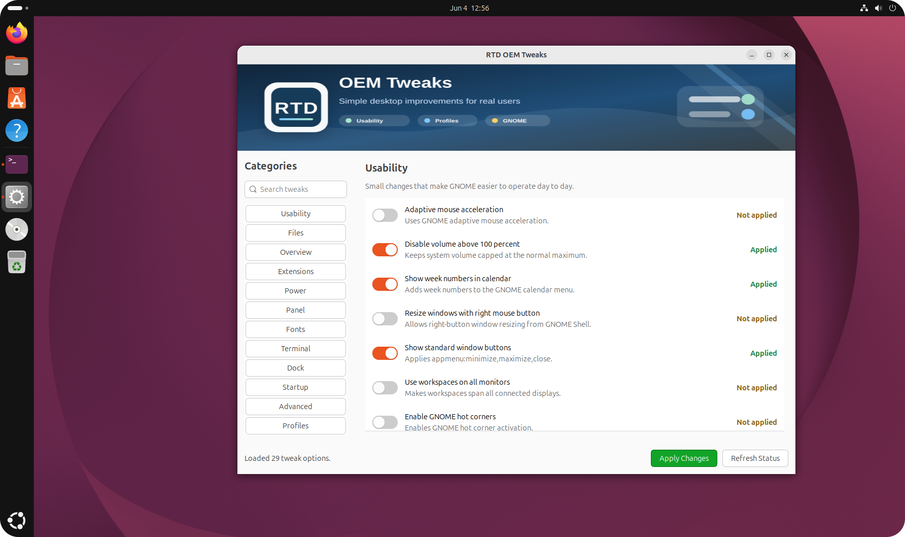

# RTD OEM Tweaks

`rtd-oem-tweaks` is a polished GTK tool for GNOME desktops. It presents
individual GNOME tweaks as stateful toggle rows, shows live applied/not-applied
state, can apply or reset supported tweaks from those toggles, and can save reusable tweak profiles under
`~/.config/rtd/oem-tweak-profiles/`.

It exposes useful GNOME tweak functions from `core/_rtd_library`, including:

- Individual usability and desktop settings such as mouse acceleration, window
  buttons, workspace behavior, clock details, battery percentage, hot corners,
  sleep behavior, and Tracker battery behavior.
- Nautilus and Overview application category tuning (`configure_nautilus`, `organize_overlay_menu`)
- Extension and panel/dock tuning (`set_basic_extensions_enabled`, `configure_dash_to_dock`, `configure_dash_to_panel`)
- Terminal and Tilix preferences (`set_tilix_ui_tweaks_for_user`, `_apply_terminal_preferences`)
- Theme maintenance helpers (`_reset_ui_theme_settings`, `_reload_shell_theme`, `ensure_window_buttons_visible`, `_apply_gtk4_theme`)
- Startup sound control (`set_startup_sound`)

Full visual style presets such as Windows, macOS, Corporate Crisp, and Moca are
intentionally handled by the separate theme tooling, not this tweak tool.

## Screenshot



## Usage

Run the graphical interface:

```bash
rtd-oem-tweaks
```

The launcher opens the Python GTK interface when the GTK bindings are available.
If they are not available, it falls back to a Zenity checklist where checked
rows are enabled and unchecked applied rows are reset.

Print live tweak status:

```bash
rtd-oem-tweaks --status
```

Force the fallback checklist:

```bash
rtd-oem-tweaks --zenity
```

Apply selected tweaks from the command line:

```bash
rtd-oem-tweaks --apply app_folders battery_percent clock_details
```

## Profiles

Use the `Profiles` page in the GTK interface, or the `SAVE PROFILE`,
`LOAD PROFILE`, and `DELETE PROFILE` buttons in the fallback checklist.
Profiles are simple text files stored in:

```text
~/.config/rtd/oem-tweak-profiles/
```

Each profile contains one enabled tweak ID per line, making it easy to inspect
or copy profiles between systems. In the GTK and Zenity interfaces, applying a
profile makes the current toggles match the profile.

## Notes

- Must be run as the regular desktop user (not `root`) so `gsettings` updates the correct GNOME profile.
- Use elevated privileges only for separate package installation actions, such as installing missing GTK or Zenity dependencies.
- Requires a GNOME desktop session.
- Uses Python GTK for the polished interface and `zenity` for fallback.
- Some advanced items prompt for extra input (for example custom GTK4 theme values or startup sound file).
