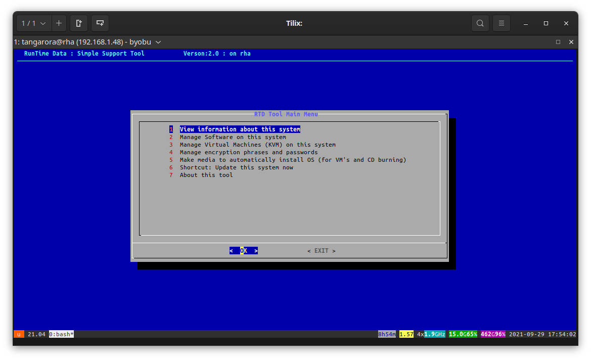
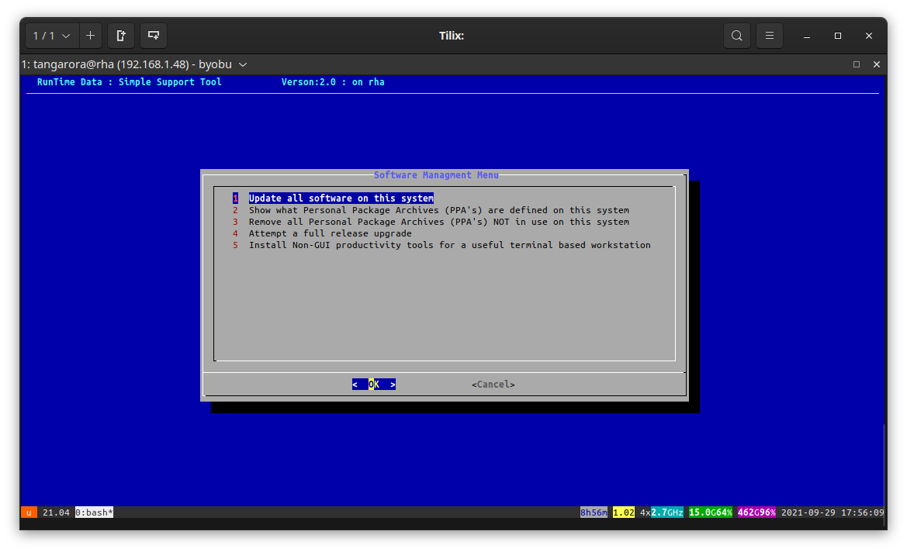

# RTD Simple Support Tool

[Back to Tool Reference](../../docs/TOOLS.md) | [Back to Modules](../README.md)


## Purpose

`rtd-simple-support-tool` presents common support operations in a terminal-oriented menu, making it practical to inspect or maintain a Linux computer locally or through a remote shell without remembering each individual RTD command.

## Good For

- Initial investigation of a Linux computer during a support session.
- Running common maintenance tasks through a single menu.
- Supporting a remote Debian-family or RPM-family host over SSH.

## Available Tasks

The menu exposes workflows such as:

- Displaying system information.
- Updating installed software.
- Backing up virtual machines.
- Reporting on or cleaning package repository configuration.
- Showing public system location information.
- Checking whether a proposed password appears in a breach-data service.

The exact operations available depend on the installed RTD library and tools on the target system.

## Requirements

- Bash and the RTD `_rtd_library`.
- Terminal interaction suitable for the menu prompts.
- Administrator authorization for tasks that change the system.
- Network access for operations that query remote services or download packages.

## Quick Start

```bash
rtd-simple-support-tool
```

When running a copy directly rather than an installed command:

```bash
bash /path/to/rtd-simple-support-tool
```

## What It Changes

The menu itself is a launcher. Reporting choices are read-only, while update, cleanup, backup, or configuration choices may install packages, modify configuration, or write backup data. Review the selected action before confirming it.

## Related Tools

- [`rtd-update-system`](../oem-system-update.mod/README.md) for direct software updates or today's update report.
- [`rtd-system-hardware-information`](../system-hardware-information.mod/README.md) for a graphical local hardware report.
- [`rtd-oem-backup-linux-config`](../system-user-backup.mod/README.md) for user data backups before rebuilding a machine.

## Screenshots



