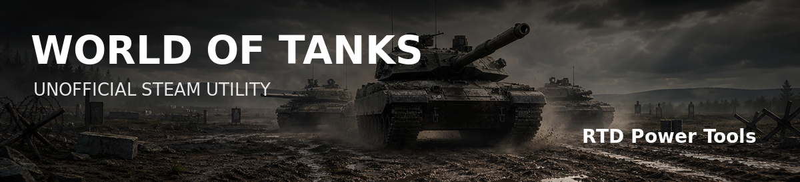
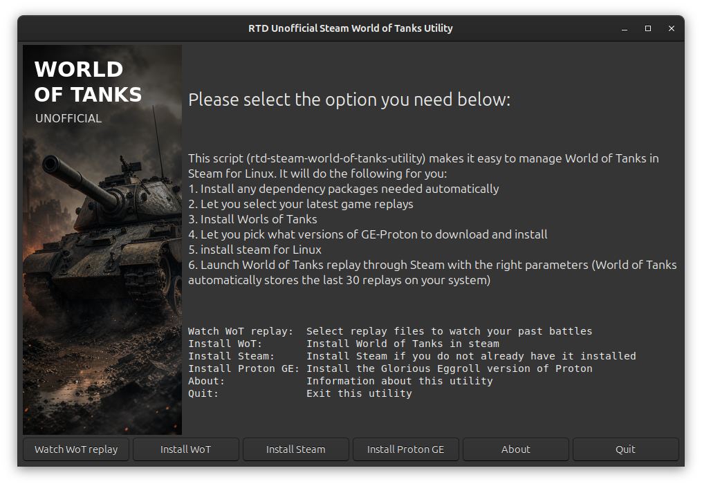
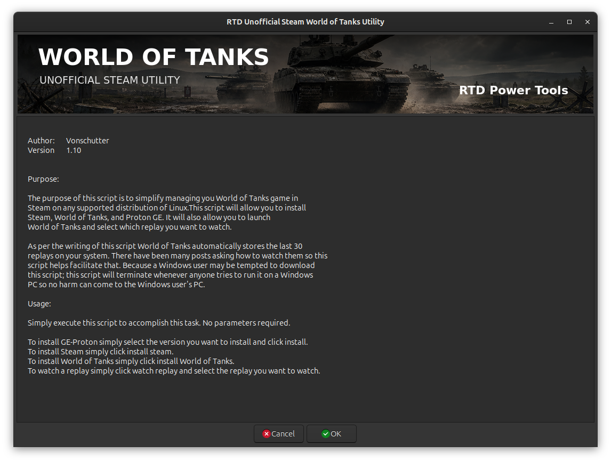
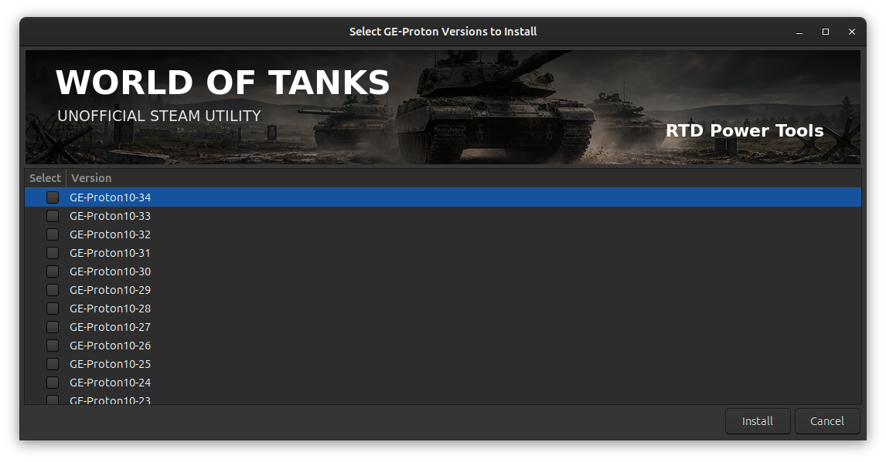
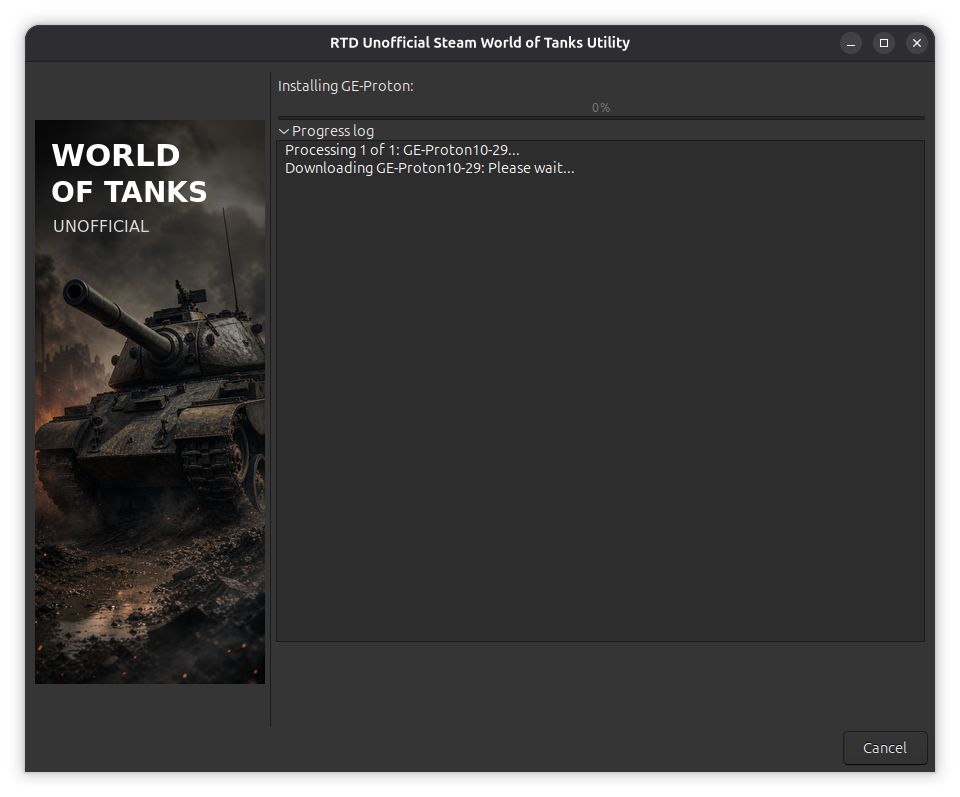

# Steam World of Tanks Utility

< [Back](https://github.com/vonschutter/RTD-Setup/blob/main/README.md) |


Watching your own World of Tanks replays and getting the latest GE-Proton on Ubuntu or any other Linux distribution has never been easier! Just launch the script and pick your battle or Proton version!

## Overview

The purpose of this script is to simplify some tasks with your World of Tanks game. It makes it easy to watch your replays, add the latest version of GE-Proton for Steam games, and some other tasks. As of this writing World of Tanks automatically stores the last 30 replays on your system. There have been many posts asking how to watch them on Steam and Linux, so this script helps facilitate watching your WoT (installed via Steam) replays on Linux.

Source: [Information at Valve (Steam)](https://developer.valvesoftware.com/wiki/Command_Line_Options#Command-Line_Parameters_2 "List of parameters ")

## Install And Run

Use one of these two methods.

### Option 1: Install RTD Power Tools

This is the recommended option if you want the normal RTD command, menu launcher, shared library support, and future updates.

```sh
curl -fsSL https://raw.githubusercontent.com/vonschutter/RTD-Setup/main/rtd-me.sh.cmd -o rtd-me.sh.cmd
bash ./rtd-me.sh.cmd
```

After installation, start the utility from your application menu or run:

```sh
rtd-steam-world-of-tanks-utility
```

### Option 2: Download This Utility Directly

Use this option if you only want to test or run the World of Tanks helper without installing the full RTD toolset.

```sh
wget https://github.com/vonschutter/RTD-Setup/raw/main/modules/steam-world-of-tanks-utility.mod/rtd-steam-world-of-tanks-utility
chmod +x ./rtd-steam-world-of-tanks-utility
./rtd-steam-world-of-tanks-utility
```

No command-line parameters are required.

## What It Can Do

1. Install required dependency packages when needed.
2. Find and launch recent World of Tanks replay files through Steam.
3. Install Steam when it is not already present.
4. Start the World of Tanks Steam install page.
5. Let you select GE-Proton versions to download and install.
6. Return to the main menu after completing each task.

Bring your own Steam account and World of Tanks installation. Replays must be enabled and available in one of the supported Steam locations.

Main Window:


Select Replay:


Select GE-Proton Versions to install:


Installing Proton:

