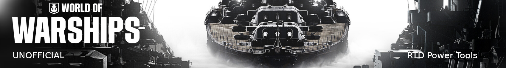
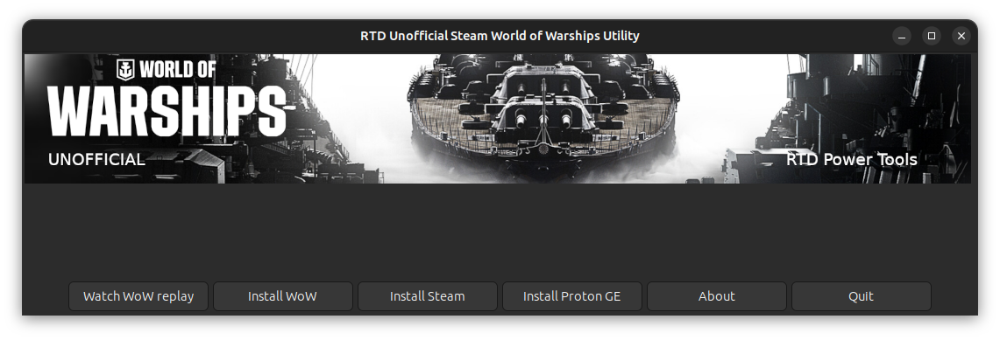
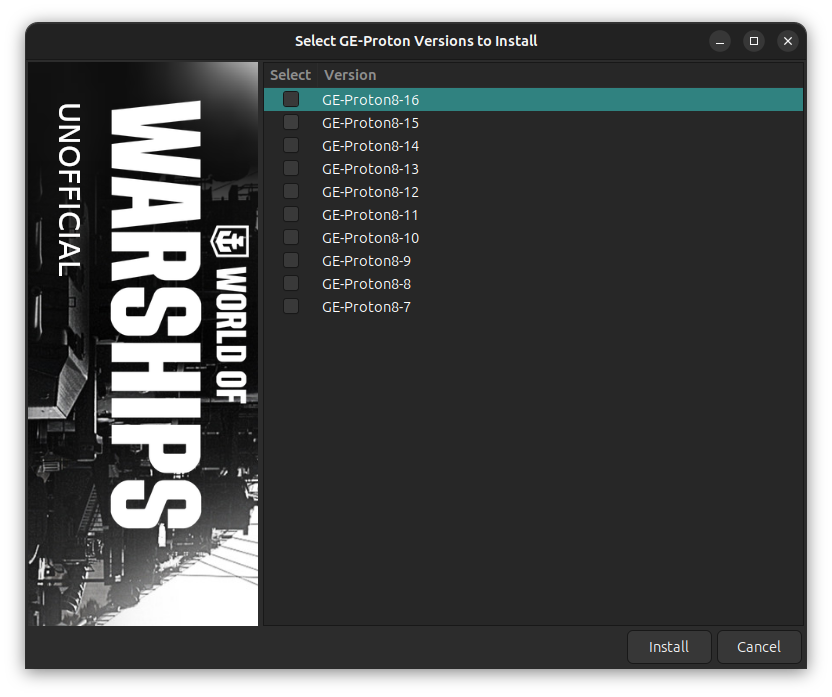
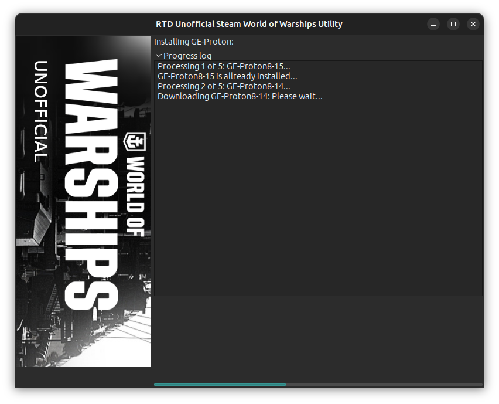

# Steam World of Warships Utility

< [Back](https://github.com/vonschutter/RTD-Setup/blob/main/README.md) |

Watching your own World of Warships replays and geting the latest GE-Proton on Ubuntu or any other Linux distribution has never been easier! Just launch the script and pick your battle or Proton version!

## Overview:

The purpose of this script is to simplify some tasks with your world of Warships game. It makes it easy to watch your replays, add the latest version of GE-Proton for Steam games, and some other tasks. As per the writing of this script World of Warships automatically stores the last 30 replays on your system. There have been many posts asking how to watch  them on Seam and Linux, so this script helps facilitate watching your WoW's (installed via Steam) replays on Linux.

Usage:	Simply execute this script to accomplish this task. No parameters required.
Source: [Information at Valve (Steam)](https://developer.valvesoftware.com/wiki/Command_Line_Options#Command-Line_Parameters_2 "List of parameters ")

Main Window:

Select Replay:

Select GE-Proton Verions to install:

Installing Proton:

## How to use this script.

To use this script just download this script (rtd-steam-world-of-warships-utility)
to your home folder and run it. It will automatically:

1. Install any dependency
2. Let you select your latest game replays
3. Launch World of Warships replay through Steam with the right parameters
4. Let you pick what versions of GE-Proton to download and install
5. install steam
6. Install WoW
