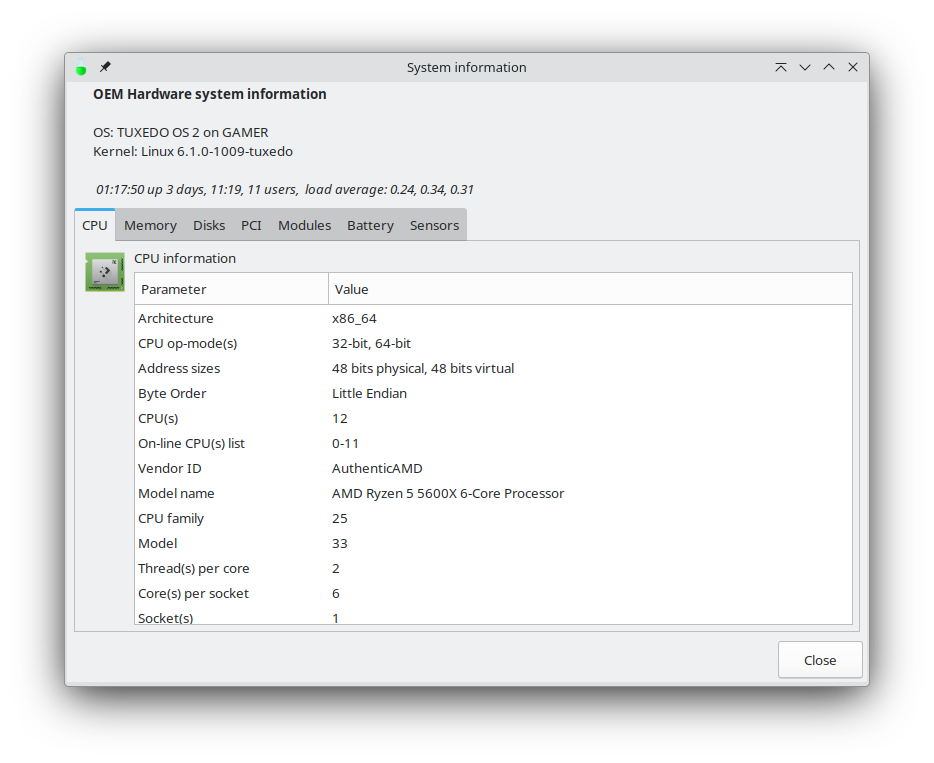
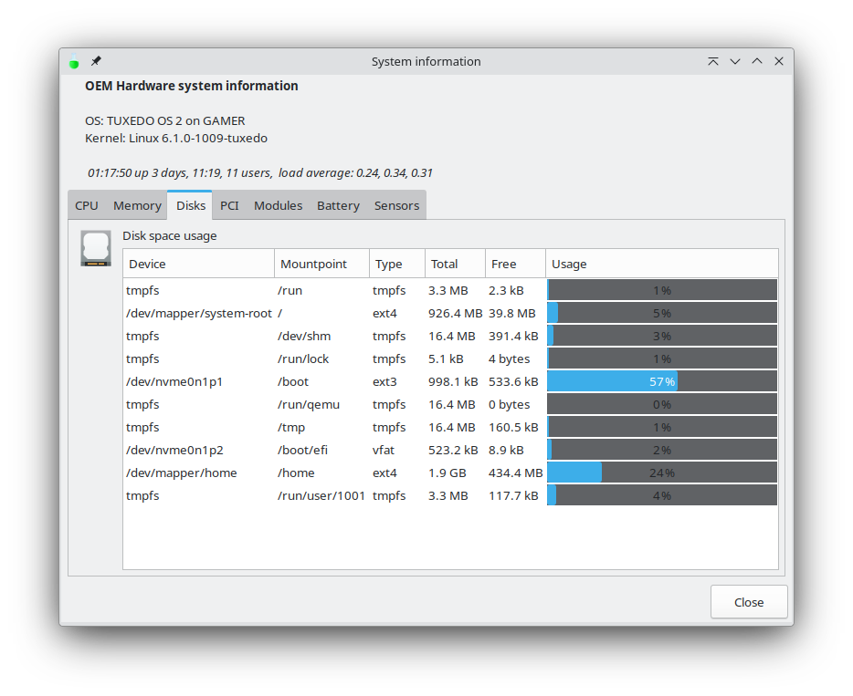

# Simple System Hardware Information
< [Back](https://github.com/vonschutter/RTD-Setup/blob/main/README.md) |

The simple hardware viewer (`rtd-system-hardware-information`) launches a YAD-based dashboard that reads hardware and sensor data directly from the system so you can answer “what hardware is in this box?” without digging through multiple tools. It runs on any distro with basic CLI tooling.

## What it shows
- Overview pulled from `hostnamectl` plus kernel and chassis details
- CPU, memory, disk/partition, PCI and USB device lists
- Kernel modules (with inline `modinfo`), battery stats, and temperature sensors
- Live buttons to open `modinfo` for a selected module

## Usage
```bash
rtd-system-hardware-information
```
No arguments are required. The script will install its lightweight dependencies (`yad`, `acpi`, `pciutils`) if they are missing, then open tabs for each data source. Close the window to exit.

## Installation
The tool ships with the RTD Power Tools. To install the full toolkit on a fresh machine:
```bash
wget https://github.com/vonschutter/RTD-Setup/raw/main/rtd-me.sh.cmd && bash ./rtd-me.sh.cmd
```

## Screenshots


