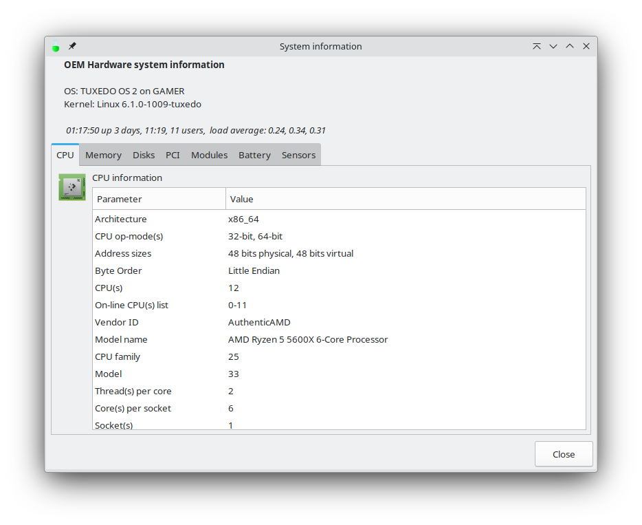
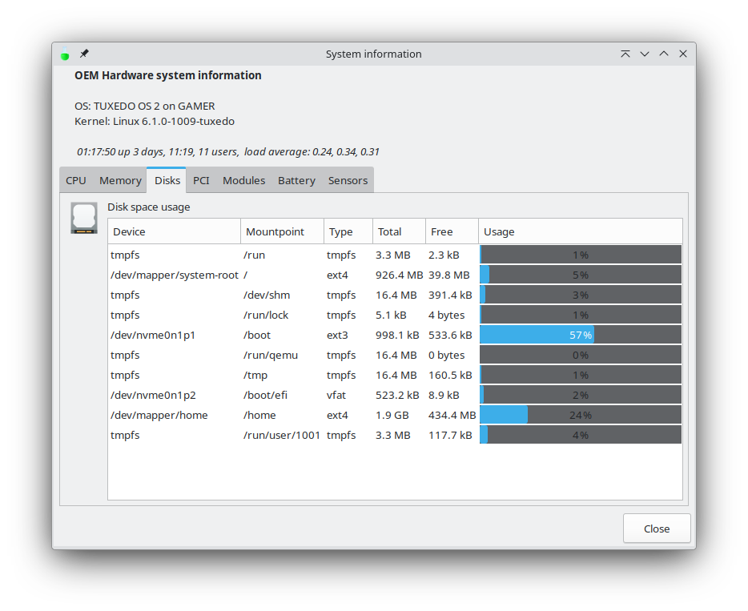

# Simple System Hardware Information

Simple System Hardware Information tool is a utility for viewing informatoin about your system. All desktops do not include a user tool to view these details so a simple accessible tool to see information about hardware is useful for support putrposes. 


## Screenshots






## Installation

This tool is part of the RTD Power Tools and is included in the standard install. 

To get these tools for yourself on Linux just copy and paste the line below in to a terminal:

```bash
wget https://github.com/vonschutter/RTD-Setup/raw/main/rtd-me.sh.cmd && bash ./rtd-me.sh.cmd
```

Alternatively, if you do not want to download the install script, you can run it direclty from the URL like this:

```bash
curl -sL https://github.com/vonschutter/RTD-Setup/raw/main/rtd-me.sh.cmd|bash
```

Please note that you will need elevated priviledges on the Linux system (root).
