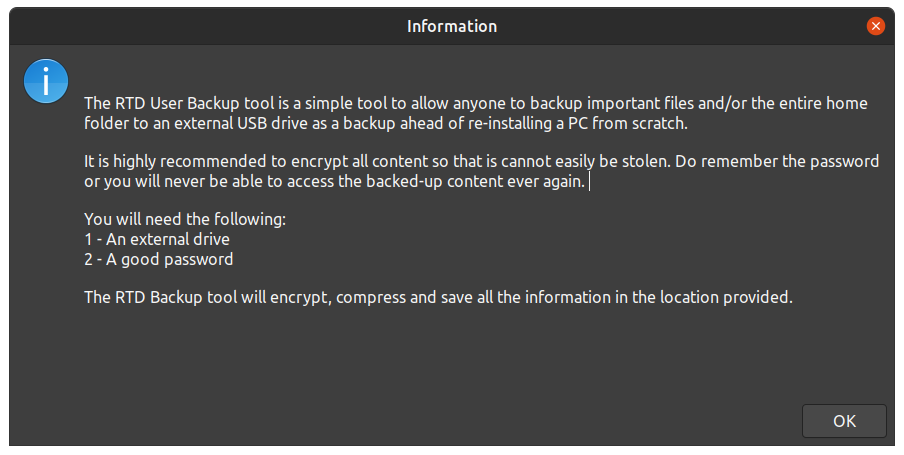
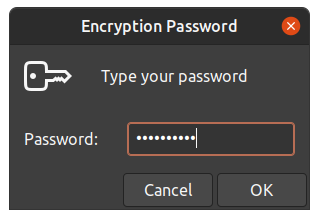
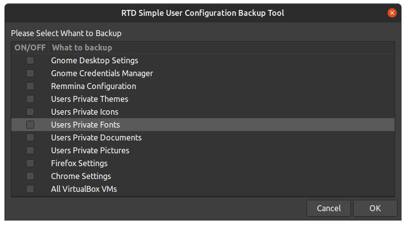
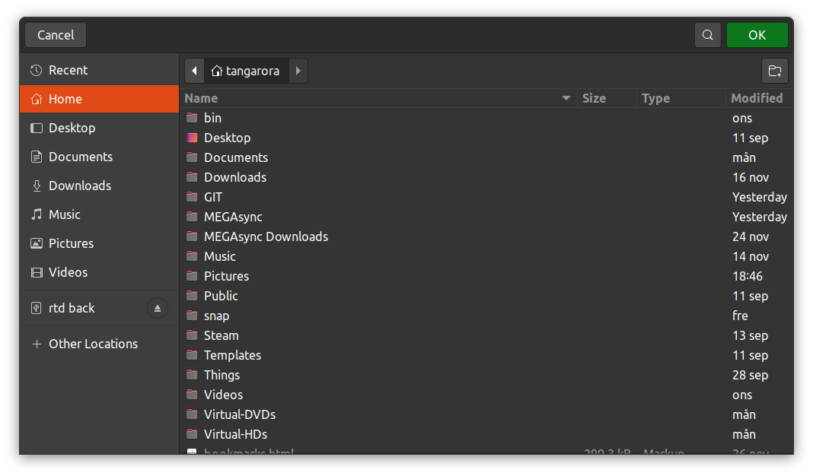
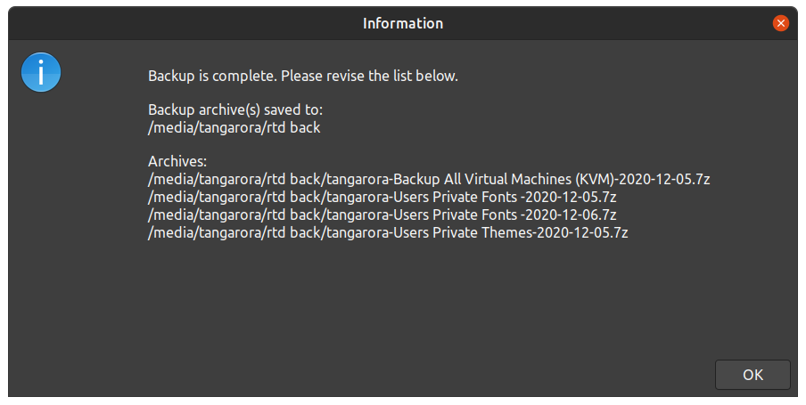

# RTD User Backup Tool:
< [Back](https://github.com/vonschutter/RTD-Setup/blob/main/README.md) |


The RTD User Backup is a tool to simplify backup of a user's data in a local home folder.
It will aks if you want ot back up some usual options:

```
 1. Gnome Desktop Setings
 2. Gnome Credentials Manager
 3. Remmina Configuration
 4. Users Private Themes
 5. Users Private Icons
 6. Users Private Fonts
 7. Users Private Documents
 8. Users Private Pictures
 9. Firefox Settings
 10. Chrome Settings
 11. All VirtualBox VMs
 12. Teamviewer Configuration
 13. Backup entire HOME folder
 14. Backup All Virtual Machines (KVM)
```

Any option or options may be selected. The files will be encrypted and highly compressed to a destination of choice.
To use a nework location that location mst first me "mounted" on the local system first.

## Usage
```bash
rtd-oem-backup-linux-config
```
What happens:
- Elevates with sudo when needed, then loads the shared `_rtd_library`
- Presents a checklist (options above) via `dialog`
- Creates an encrypted, compressed archive in the destination you choose (external drive or mounted network path)
- Logs activity under `/var/log/rtd`

## Screenshots:

**Backup initial launch:**
Information displayed when the app is launched.


**Backup Passphrase Prompt:**
The too will insist that you provide a password to use as an encryption key for your backup. This s a requirement.
you backup must be encrypted because the reason for using this tool is generally to manually bakup a users data to an
external device before reinstalling the Operating System on the same machine or to move from one computer to the next.



**Backup Choices**
Backup choices are generally choosing the whole home folder of a user (99% of the time), but some choices are provided
beyond that. It is possible to make a few selective choices beynod the whole home folder that make sense. It may be that the
personal settings are not compatible with the upgraded system or the new system for some reason and it may just make sense to grab
documents, pictures, videos, personal fonts, and any VM's. Please NOTE that KVM Virtual Machines reside in the system part outside
of the users own data and the system password will be requested; unless the system password is used as the encryption password (it will then be automatic).


**Backup Destination Selection:**
The backup requires a destination to be selected. This is usually an external disk or a large thumbdrive. This uses a hight level of
compression to make the best use of the storage.


**Backup Completion Notification:**
Once all the backup tasks are completed (none of them are mutually exclusive) an notification of the location and filenamese
will be displayed. The filenames include the date in the name.

