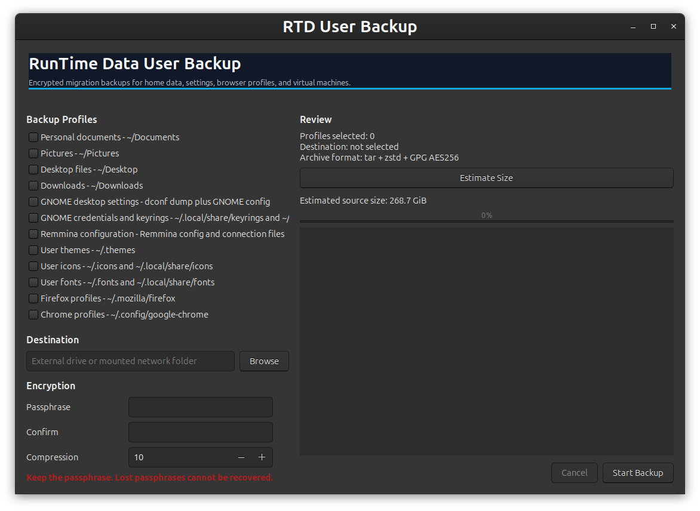

# RTD User Backup Tool


`rtd-oem-backup-linux-config` creates encrypted migration backups for user data, desktop settings, browser profiles, remote-access configuration, and virtual machine storage.

The public command launches a GTK frontend in graphical sessions. The same command also provides a backend CLI for scripted use.

## Common Use

```bash
rtd-oem-backup-linux-config
```

Force the GTK frontend:

```bash
rtd-oem-backup-linux-config --gui
```

List available backup profiles:

```bash
rtd-oem-backup-linux-config --no-gui --list-profiles
```

Create a backup from the CLI:

```bash
printf '%s' 'your strong passphrase' > /tmp/rtd-backup-pass
chmod 600 /tmp/rtd-backup-pass
rtd-oem-backup-linux-config --no-gui \
  --backup \
  --profiles documents,pictures,firefox \
  --destination /media/$USER/BackupDrive \
  --passphrase-file /tmp/rtd-backup-pass
rm -f /tmp/rtd-backup-pass
```

## Run Directly From GitHub

The script can be run without installing the full repository. It bootstraps `_rtd_library` from the RTD repository when the library is not already present locally. In a graphical desktop session it also fetches the internal GTK helper, `user-backup-gtk.py`, into the RTD cache when the helper is not available beside the script. When launched through shell process substitution, the backend is also cached so the GUI can call a stable script path.

Using `curl`:

```bash
bash <(curl -fsSL https://raw.githubusercontent.com/vonschutter/RTD-Setup/main/modules/system-user-backup.mod/rtd-oem-backup-linux-config)
```

Using `wget`:

```bash
bash <(wget -qO- https://raw.githubusercontent.com/vonschutter/RTD-Setup/main/modules/system-user-backup.mod/rtd-oem-backup-linux-config)
```

Download first, then run:

```bash
curl -fsSL https://raw.githubusercontent.com/vonschutter/RTD-Setup/main/modules/system-user-backup.mod/rtd-oem-backup-linux-config -o /tmp/rtd-oem-backup-linux-config
bash /tmp/rtd-oem-backup-linux-config
```

CLI backup direct from GitHub:

```bash
printf '%s' 'your strong passphrase' > /tmp/rtd-backup-pass
chmod 600 /tmp/rtd-backup-pass
bash <(curl -fsSL https://raw.githubusercontent.com/vonschutter/RTD-Setup/main/modules/system-user-backup.mod/rtd-oem-backup-linux-config) \
  --no-gui \
  --backup \
  --profiles documents,pictures,firefox \
  --destination /media/$USER/BackupDrive \
  --passphrase-file /tmp/rtd-backup-pass
rm -f /tmp/rtd-backup-pass
```

Direct execution requires `bash` 4.4 or newer and either `curl` or `wget` for bootstrap downloads. Runtime dependencies such as `zstd`, `gpg`, `pv`, `tar`, `sha256sum`, Python, and GTK bindings are checked through RTD `_rtd_library` dependency helpers and installed through the native package manager where possible.

## Main Window



## Backup Profiles

- `documents` - `~/Documents`
- `pictures` - `~/Pictures`
- `desktop` - `~/Desktop`
- `downloads` - `~/Downloads`
- `gnome` - GNOME and GTK settings, including a `dconf dump`
- `keyring` - GNOME keyrings and GnuPG configuration
- `remmina` - Remmina connection/configuration files
- `themes` - user themes
- `icons` - user icon themes
- `fonts` - user fonts
- `firefox` - Firefox profiles
- `chrome` - Chrome profiles
- `virtualbox` - VirtualBox virtual machines
- `teamviewer` - TeamViewer configuration
- `home` - entire home folder, excluding common cache/trash/archive patterns
- `kvm` - KVM/libvirt storage and domain XML; requires root authorization

## Archive Format

The default archive format is:

```text
tar + zstd + GPG symmetric AES256
```

Archives are written as:

```text
<user>-backup-<UTC timestamp>.tar.zst.gpg
<user>-backup-<UTC timestamp>.tar.zst.gpg.sha256
```

Each archive includes:

```text
RTD_BACKUP_METADATA/manifest.json
```

The manifest records the tool version, timestamp, hostname, backup user, selected profiles, user home, and included source paths.

## Restore

Verify the checksum:

```bash
sha256sum -c user-backup.tar.zst.gpg.sha256
```

List archive contents:

```bash
gpg --decrypt user-backup.tar.zst.gpg | zstd -d | tar -tf -
```

Extract to a staging directory:

```bash
mkdir -p ~/Restore-Staging
gpg --decrypt user-backup.tar.zst.gpg | zstd -d | tar -xpf - -C ~/Restore-Staging
```

Review the extracted files before copying them back into a live profile.

## Safety Notes

- Keep the passphrase. It cannot be recovered.
- The passphrase is passed to GPG through a file descriptor, not as a command-line argument.
- KVM backups require root because VM disk images are usually stored outside the user home.
- The tool no longer changes `/var/lib/libvirt` permissions to perform KVM backups.
- Backups exclude common cache, trash, and existing archive patterns when backing up a full home folder.

## GUI

The GTK frontend is implemented in `user-backup-gtk.py`. It is intentionally not named `rtd-*`, so it is not exposed as a separate system command.

The GUI provides:

- profile checklist
- destination picker
- passphrase confirmation
- size estimation
- compression level selector
- live progress output
- backend log stream
