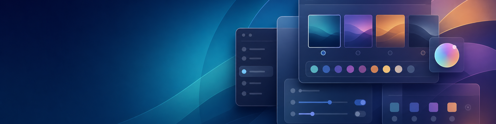

# RTD GNOME Theme Manager

[Back to Tool Reference](../../docs/TOOLS.md) | [Back to Modules](../README.md)

## Purpose

`rtd-theme-manager` discovers available GNOME themes and opens a polished GTK interface for applying complete themes or mixing individual GNOME appearance elements.



## Good For

- Applying every available element from one installed theme.
- Mixing application, Shell, icon, cursor, light or dark preference, and wallpaper settings.
- Applying complete RTD desktop profiles with screenshot previews.

## Requirements

- A GNOME desktop session.
- `gsettings`.
- Themes installed under `~/.themes` or `/usr/share/themes`.

The launcher uses the polished Python GTK interface when possible. If its GTK
bindings are missing, RTD installs the appropriate native packages for Debian,
Ubuntu, Fedora, Red Hat, and SUSE families. If a repository cannot provide
those bindings, the tool automatically installs and opens a YAD interface,
with Zenity as the final fallback.

Force a compatibility interface for testing or support:

```bash
rtd-theme-manager --yad
rtd-theme-manager --zenity
```

## Quick Start

Run this command as the logged-in desktop user:

```bash
rtd-theme-manager
```

Display built-in help:

```bash
rtd-theme-manager --help
```

## Interface

- **Complete Theme** applies all matching components from one installed theme and can select an included wallpaper.
- **Individual Elements** provides separate selectors for every supported GNOME appearance element.
- **RTD Desktop Profiles** shows a professional screenshot selector for familiar complete profiles and applies them directly.

## What It Changes

The tool updates desktop theme and optional wallpaper settings for the current GNOME user. RTD desktop profiles may also install theme assets, enable GNOME extensions, adjust panel behavior, and change user appearance settings. When a Shell theme is selected, RTD installs and enables the GNOME User Themes extension when needed. GNOME may require a logout and login before a newly installed extension becomes active.

## Related Tools

- [`rtd-desktop-look-switcher`](../rtd-desktop-look-switcher.mod/README.md) is retained as a compatibility launcher for this manager.
- [`rtd-oem-tweaks`](../rtd-oem-tweaks.mod/README.md) applies selected workstation usability settings.
- [`rtd-gnome-shell-extension-installer`](../gnome-shell-extension-installer.mod/README.md) installs extensions directly.
