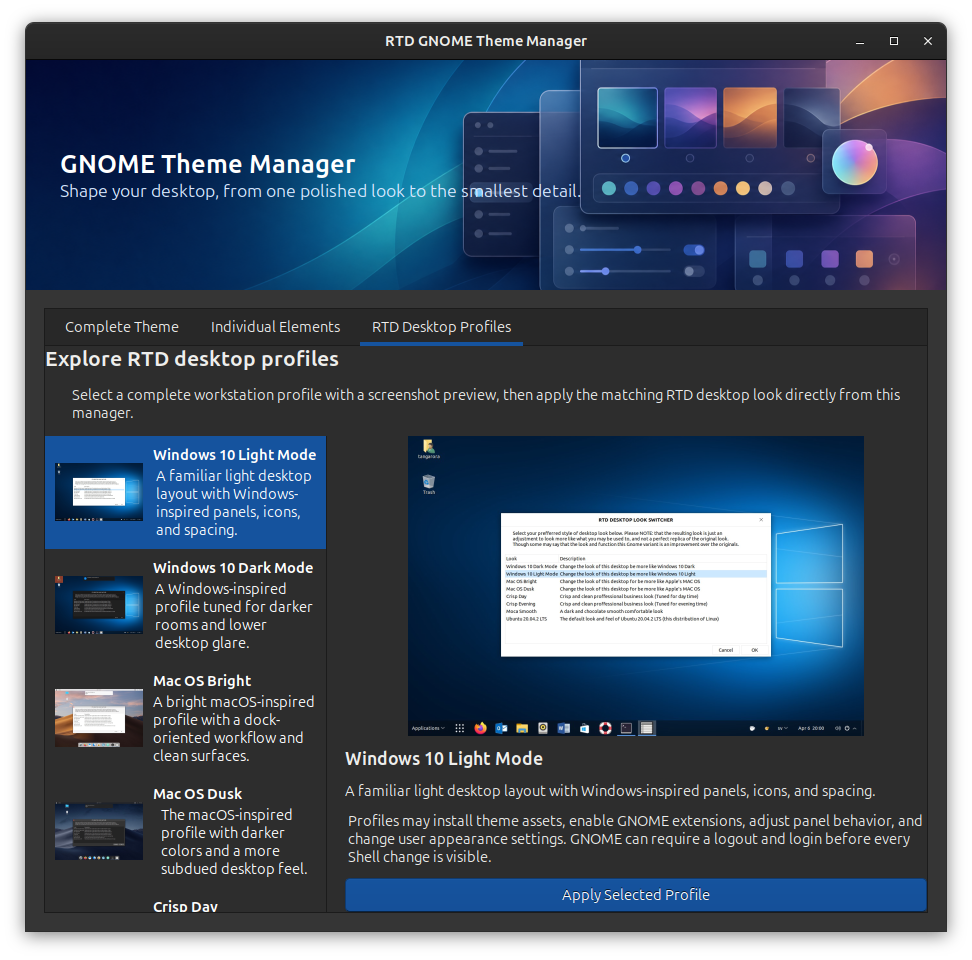

# RTD Theme Manager


[Back to Tool Reference](../../docs/TOOLS.md) | [Back to Modules](../README.md)

## Purpose

`rtd-theme-manager` opens the RTD desktop appearance manager. In GNOME it discovers available themes and opens a polished GTK interface for applying complete themes, mixing individual GNOME appearance elements, selecting RTD wallpapers, or applying RTD desktop profiles. In KDE Plasma it does not show the GNOME-specific chooser; it opens KDE's native Global Theme settings module instead as KDE is extrodinarily configurable and has excellent tools to accomplish these tasks natively.



## Good For

- Applying every available element from one installed theme.
- Mixing application, Shell, icon, cursor, light or dark preference, and wallpapers from `/opt/rtd/themes/wallpaper`.
- Applying complete RTD desktop profiles with screenshot previews.
- Handing KDE Plasma users to the graphical KDE Global Theme settings module.

## Requirements

- A graphical desktop session.
- GNOME: `gsettings`, Python GTK bindings, and themes installed under `~/.themes` or `/usr/share/themes`.
- KDE Plasma: `kcmshell6`, `kcmshell5`, or `systemsettings` for the native Global Theme module.

The launcher uses the polished Python GTK interface when possible. If its GTK
bindings are missing, RTD installs the appropriate native packages for Debian,
Ubuntu, Fedora, Red Hat, and SUSE families. If a repository cannot provide
those bindings, the tool automatically installs and opens a YAD interface,
with Zenity as the final fallback.

Force a compatibility interface for testing or support:

```bash
rtd-theme-manager --yad
rtd-theme-manager --zenity
```

## Quick Start

Run this command as the logged-in desktop user:

```bash
rtd-theme-manager
```

Display built-in help:

```bash
rtd-theme-manager --help
```

Open KDE's native Global Theme settings directly:

```bash
rtd-theme-manager --kde-look-settings
```

Apply a GNOME desktop profile from a script:

```bash
rtd-theme-manager --apply-profile crisp-day
```

## Interface

- **Complete Theme** applies all matching components from one installed theme and can select an RTD wallpaper from `/opt/rtd/themes/wallpaper`.
- **Individual Elements** provides separate selectors for every supported GNOME appearance element.
- **RTD Desktop Profiles** shows a professional screenshot selector for familiar complete profiles and applies them directly.

Available RTD desktop profile IDs:

- `win10-light`
- `win10-dark`
- `mac-bright`
- `mac-dusk`
- `crisp-day`
- `crisp-evening`
- `moca-smooth`
- `distro-reset`

## KDE Plasma Behavior

When `rtd-theme-manager` is launched in a KDE Plasma session, it uses the RTD library desktop detection helper and routes the user to KDE's own Global Theme settings module. The launcher tries these commands in order:

1. `kcmshell6 kcm_lookandfeel`
2. `kcmshell5 kcm_lookandfeel`
3. `systemsettings kcm_lookandfeel`

This is intentional. The GTK theme manager controls GNOME-specific settings such as `gsettings`, GNOME Shell themes, GNOME extensions, and GNOME desktop profiles. Those controls do not apply cleanly to Plasma, so KDE users get the native Plasma UI where installed global themes can be previewed and applied properly.

The same behavior is available explicitly with:

```bash
rtd-theme-manager --kde-look-settings
```

## What It Changes

In GNOME, the tool updates desktop theme and optional wallpaper settings for the current user. RTD desktop profiles may also install theme assets, enable GNOME extensions, adjust panel behavior, and change user appearance settings. When a Shell theme is selected, RTD installs and enables the GNOME User Themes extension when needed. GNOME may require a logout and login before a newly installed extension becomes active.

In KDE Plasma, the tool does not directly write Plasma theme settings. It launches KDE's Global Theme settings module and lets KDE apply Plasma global themes through its supported configuration path.

## Related Tools

- [`rtd-desktop-look-switcher`](../rtd-desktop-look-switcher.mod/README.md) is retained as a compatibility launcher for this manager.
- [`rtd-oem-tweaks`](../rtd-oem-tweaks.mod/README.md) applies selected workstation usability settings.
- [`rtd-gnome-shell-extension-installer`](../gnome-shell-extension-installer.mod/README.md) installs extensions directly.
