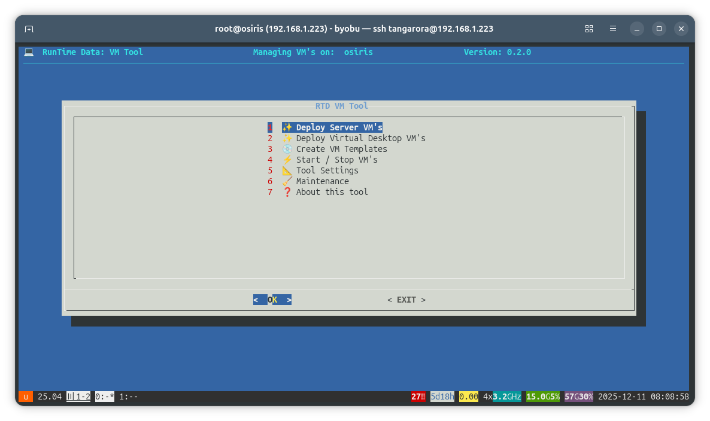

# VM Tool Module


This module ships `rtd-vm-tool`, a menu-driven Bash utility for managing KVM/libvirt virtual machines in the RTD stack, and `rtd-vm-tool-gtk`, a Zenity-based GTK front-end that mirrors the same menu tree. Both tools **require** the shared `_rtd_library` (auto-fetched if not already loaded). The tools call `rtd::bootstrap_library "_rtd_library"` on startup and exit if the library cannot be sourced.

## Features

- Dialog (Text GUI) based interface for common VM operations.
- Zenity/GTK launcher for the same main/template/settings/maintenance menu tree.
- Server VM deploy: clone server templates with optional post-clone Ansible pull (via `vmtool::post_clone_ansible_pull`).
- Virtual desktop deploy: clone VDI templates.
- Create VM templates: guided creation for server roles (Ubuntu, Debian, Fedora, etc.) and VDI desktops.
- Start/stop VMs from a simple menu.
- Settings: adjust clone preferences via `RTD_VM_CLONE_ARGS`.
- Maintenance: run maintenance helpers from a dedicated menu.

## Requirements

- Bash shell.
- KVM/libvirt on the host with appropriate permissions; `virsh`/`qemu` available.
- `dialog` for the TUI (`RTD_GUI` controls the picker; default `dialog`).
- `_rtd_library` v2.04+ (loaded via `rtd::bootstrap_library "_rtd_library"` inside the script). The tool depends on `kvm::` functions and `write_*` helpers and will not operate without the library.

## Usage

```bash
bash rtd-vm-tool
```

GTK front-end:

```bash
bash rtd-vm-tool-gtk
```

If installed on your `$PATH`, simply run:

```bash
rtd-vm-tool
```

## Screenshot



## Notes

- Logging/output follows the script’s dialog/whiptail presentation and `write_*` helpers from `_rtd_library`.
- The tool honors RTD branding/version strings defined at the top of the script.
- `_rtd_library` is plain Bash and publicly auditable in the RTD-Setup repository.
