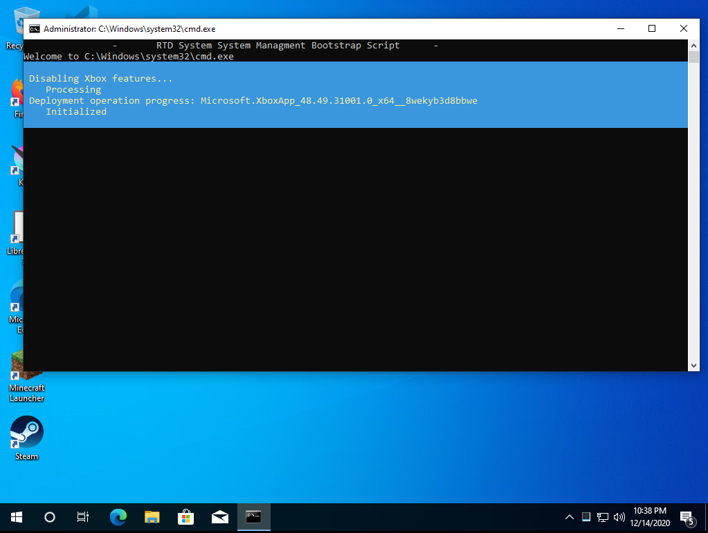
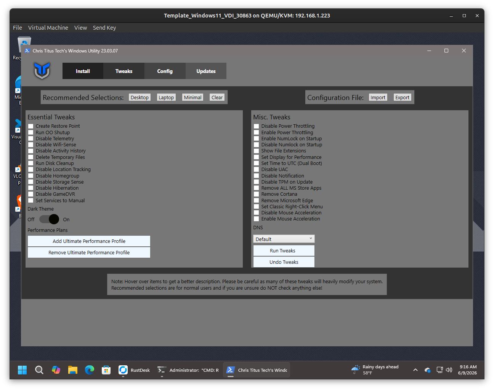

# RTD Windows VM Module

`windows.mod` contains optional Windows guest scripts and payloads that RTD can inject into a Windows VM installation. The normal RTD VM workflow copies files from this module whose names begin with `_` onto a small virtual floppy image, then attaches that image to the Windows installer. Windows setup can then launch the included scripts from `A:\` through `Autounattend.xml` first-logon commands.

This module is intended for KVM/QEMU Windows guests where RTD is already preparing the VM definition, Windows install media, and unattended setup files.

## Included Payloads

- `_Chris-Titus-Post-Windows-Install-App.ps1` - post-install Windows utility used for package installs, cleanup, feature toggles, and common desktop tweaks.
- `_MAS_AIO.zip` - optional Microsoft Activation Scripts payload archive.

Only files prefixed with `_` are treated as injectable Windows module payloads by the RTD tooling.

## User Interface

The post-install (rtd-me.sh.cmd) run by autounattend.xml. Rtd-me.cmd runs a shell command to fetch the rtd-oem*.ps1 script that sets up the system in a vm including vit-io drivers, spice vm integration, and many other apps useful to the end user.



The tweaks view groups common Windows configuration changes such as restore point creation, telemetry reduction, UI behavior, update policy, feature toggles, and cleanup tasks.



## Injection Flow

RTD creates a small FAT floppy image and copies generated setup files plus `windows.mod` payloads into it. The library implementation currently follows this pattern:

```bash
mkfs.msdos -C "${WindowsInstructions}" 1440

mcopy -o -i "${WindowsInstructions}" "${PostTasks}" ::/
mcopy -o -i "${WindowsInstructions}" "${ConfigMenu}" ::/
mcopy -o -i "${WindowsInstructions}" "${AutoUnattend}" ::/

for i in $(find /opt/${_TLA,,} -type d -name "windows.mod")/_*; do
    mcopy -o -i "${WindowsInstructions}" "${i}" ::/
done
```

The resulting floppy image is attached to the VM during Windows installation:

```bash
virt-install \
    --connect qemu:///system \
    --name "VDI_Windows${target_winver:(-2)}_${CONFIG}_${RANDOM}" \
    --vcpus "${cpu_count}" \
    --memory "${mem_size}" \
    --network "${virt_net}" \
    --video "${preferred_video}" \
    --disk size="${disk_size}" \
    --os-variant="${target_winver}" \
    --cdrom "${WindowsMedia}" \
    --disk "${WindowsInstructions}",device=floppy \
    --livecd \
    --tpm default \
    ${uefi_option}
```

## Autounattend Launch

To run a module script automatically, reference it from the generated `Autounattend.xml`. The floppy is visible to Windows setup as `A:\`.

```xml
<FirstLogonCommands>
  <SynchronousCommand wcm:action="add">
    <CommandLine>powershell -ExecutionPolicy Unrestricted -File A:\_Chris-Titus-Post-Windows-Install-App.ps1</CommandLine>
    <Description>Run post-install Windows utility</Description>
    <Order>1</Order>
  </SynchronousCommand>
</FirstLogonCommands>
```

The RTD bootstrap script also supports launching the local copy when it has been injected, with an online fallback for the Chris Titus utility if the local module file is not present.

## Operational Notes

- The VM needs working network access for online package installs, script fallbacks, and package managers such as `winget` or Chocolatey.
- Some tweaks make system-wide changes. Create a restore point before running aggressive cleanup or debloat options.
- VirtIO guest tools are installed separately by the RTD Windows bootstrap flow when the VM has network access.
- Windows may require a reboot after driver installation, feature changes, package installs, or update policy changes.
